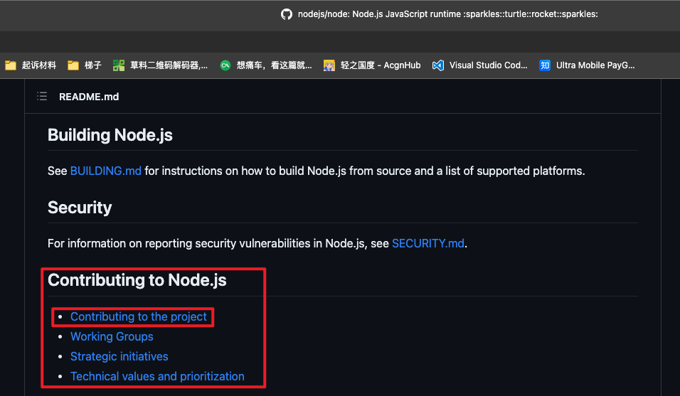
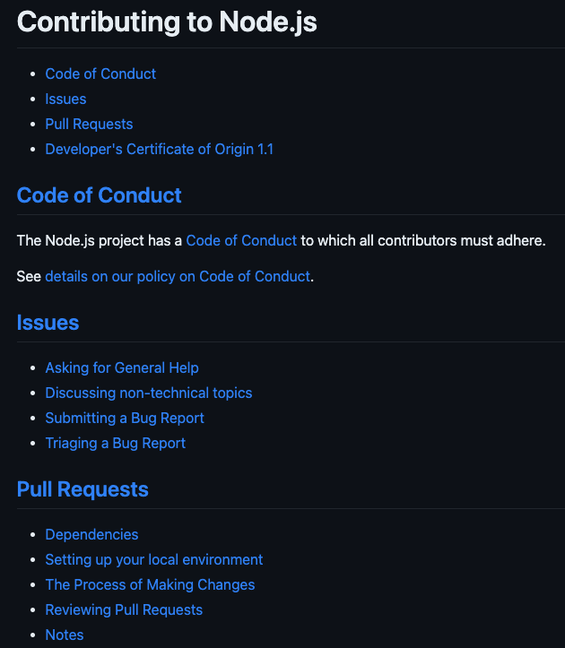
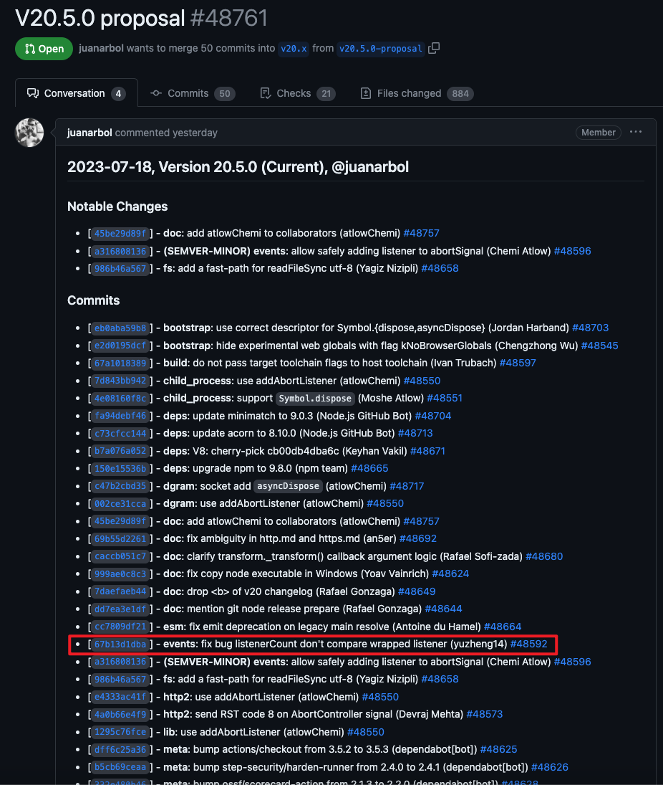

# 以 Nodejs 为例谈谈如何向开源项目贡献

前一段时间因为兴趣阅读 Nodejs 的 `EventEmitter` 相关代码的时候，发现了其中的一个 bug，所以修复后向 Nodejs 提了个 pr。同时也想以此次经历为例谈谈如何向开源项目贡献

## 发现问题

```javascript
/**
 * Returns the number of listeners listening to event name
 * specified as `type`.
 * @param {string | symbol} type
 * @param {Function} listener
 * @returns {number}
 */
function listenerCount(type, listener) {
  const events = this._events;

  if (events !== undefined) {
    const evlistener = events[type];

    if (typeof evlistener === 'function') {
      if (listener != null) {
        return listener === evlistener ? 1 : 0;
      }

      return 1;
    } else if (evlistener !== undefined) {
      if (listener != null) {
        let matching = 0;

        for (let i = 0, l = evlistener.length; i < l; i++) {
          if (evlistener[i] === listener || evlistener[i].listener === listener) {
            matching++;
          }
        }

        return matching;
      }

      return evlistener.length;
    }
  }

  return 0;
}
```

在阅读 Nodejs v18.16.0 源码 `lib/events.js` 时，发现其中的 `listenerCount` 函数（如上）有问题。截出来的部分第 16 行 `return listener === evlistener ? 1 : 0;` 中没有对通过 `once` 创建的监听函数比较处理。

该 bug 表现为，当我们执行下面的代码时，输出如下

```javascript
import { EventEmitter } from 'node:events'

const ee = new EventEmitter()

const listener = ()=>{}

ee.once('event',listener)
console.log(`ee.listenerCount('event', listener) ==>`, ee.listenerCount('event', listener))
ee.once('event',listener)
console.log(`ee.listenerCount('event', listener) ==>`, ee.listenerCount('event', listener))
```

```
ee.listenerCount('event', listener) ==> 0
ee.listenerCount('event', listener) ==> 2
```

查证后发现该 bug 为五个月前的此 pr [events: add listener argument to listenerCount by ShogunPanda · Pull Request #46523 · nodejs/node (github.com)](https://github.com/nodejs/node/pull/46523) 引入。至笔者提 pr 时在 main 分支和最新版本分支上仍未修复。所以笔者放心的提 pr 了。

## pr 流程

决定要提 pr 后，最重要的就是看看 Nodejs 的 contribute 准则了。

我们很容易就能在 Nodejs 官方 repo 的 [readme](https://github.com/nodejs/node/blob/main/README.md#contributing-to-nodejs) 中找到相关内容。



点击 [Contributing to the project](https://github.com/nodejs/node/blob/main/CONTRIBUTING.md) 就可以看到具体的 contributing 准则了



其中 Code of Conduct 中都是一些诸如不要歧视等的类似规定，一般正常人也不会触犯，可以不用看。这次笔者要提 pr，所以重点看 [Pull Request](https://github.com/nodejs/node/blob/main/doc/contributing/pull-requests.md) 部分

点进去之后按照流程一步一步走即可

最终提出来这个 pr

[events: fix bug listenerCount don't compare wrapped listener by yuzheng14 · Pull Request #48592 · nodejs/node (github.com)](https://github.com/nodejs/node/pull/48592)

## 讨论 & 合并

可能因为是个修 bug 的pr，所以没有几乎没有啥讨论，基本上就是等过自动审查和等待合并。如果是个 feature pr 的话，可能会有比较激烈的讨论，就如引入这个 bug 的 pr 一样。

向其他开源仓库 contribute 的流程也几乎大差不差。

## 现状

目前该 pr 已经计划在 Nodejs v20.5.0 发版了

