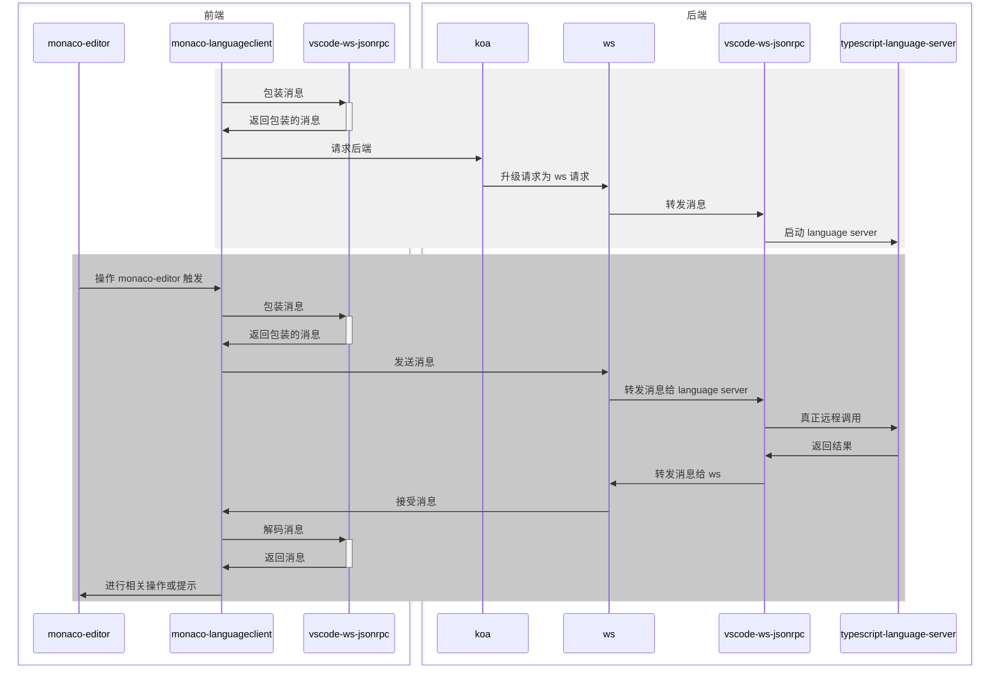

# 使用 monaco-editor 打造线上智能 IDE——以 typescript 为例

[TOC]

## 背景

最近公司有个低代码平台的项目，其中用到了 `monaco-editor` 用于编写 JavaScript 代码。但是 JavaScript 代码本身没有一个良好的类型提示，所以开启了用 TypeScript 检查 JavaScript。但是这样只能检查一些比较基础的语法，对于一些三方库的类型等几乎没有任何提示。

一开始打算使用 `monaco.editor.addExtraLib` 这个 API 将 koa 的类型定义加载进 `monaco-editor` 中，但是 `koa` 的类型比较复杂，加上各种中间件的类型，很难将 `koa` 的类型完整定义出来。

经过调研后发现了 `LSP (Language Server Protocol)` 这个方案，故采用此方案完善 `monaco-editor` 的类型提示。

网络上的中文资料很少且较老，无法适应新版本的使用官方资料又不完全对口。笔者经过大量尝试后得出此方案。

## LSP

LSP[^LSP]，全称 Language Server Protocol，是一种编辑器与 Language Server 之间通信的协议，而 Language Server 则提供了自动补全、代码跳转、语法错误提示等功能。

> **What is the Language Server Protocol?**
>
> Adding features like auto complete, go to definition, or documentation on hover for a programming language takes significant effort. Traditionally this work had to be repeated for each development tool, as each tool provides different APIs for implementing the same feature.
>
> A *Language Server* is meant to provide the language-specific smarts and communicate with development tools over a protocol that enables inter-process communication.
>
> The idea behind the *Language Server Protocol (LSP)* is to standardize the protocol for how such servers and development tools communicate. This way, a single *Language Server* can be re-used in multiple development tools, which in turn can support multiple languages with minimal effort.
>
> LSP is a win for both language providers and tooling vendors!

那么我们为什么要用 LSP 这个方案？

首先很现实的一点就是，全套方案几乎都已经有现成的三方库，我们只需要调用组合起来岂可。

往深了说，LSP 提供了一个桥梁，各种语言只需要提供一个支持 LSP 的 Language Server 即可，各个编辑器也只需要根据 LSP 进行对接即可。在以往的编辑器开发模式中，一个编辑器要支持一个语言的开发，就需要专门针对这门语言进行开发，需要支持 m 种语言就需要专门开发 m 个语言的插件。单看一个编辑器还好，如果有 n 个编辑器，那么就总共需要开发 m $\times$ n 个插件。

但是有了 LSP 之后，每种语言只需要开发一个 Language Server，每个编辑器只需要根据 LSP 开发即可，每种语言之间差别很小，几乎可以做到 m + n 的程度。


## 架构

此次前端采用 `vue` 实现（react 也很类似），后端采用 `koa` + `ws`

前端：

- vite + vue
- monaco-editor
- @codingame/monaco-vscode-api
- monaco-languageclient
- vscode-languageclient
- vscode-ws-jsonrpc

后端：

- koa
- ws
- vscode-languageserver
- vscode-ws-jsonrpc
- typescript-language-server

整个调用流程（不完全）如下



## 项目基础框架

本项目使用 pnpm workspace 进行管理

创建如下目录结构

```
├── packages
│   ├── backend
│   ├── frontend
│   └── project
├── package.json
└── pnpm-workspace.yaml
```

其中 `pnpm-workspace.yaml` 指定工作区

```yaml
packages:
  - 'packages/*'
```

## 前端

### 初始化项目

cd 到项目内，执行 `pnpm create vite . -t vue-ts` 创建前端项目，并删除多余文件

### 封装 monaco-editor 组件

新建 `packages/frontend/src/components/MonacoEditor.vue` 文件并安装 `monaco-editor` 依赖，对 `monaco-editor` 进行封装

```vue
<script setup lang="ts">
import { onMounted, onUnmounted, ref } from 'vue'
import * as monaco from 'monaco-editor'
import tsWorker from 'monaco-editor/esm/vs/language/typescript/ts.worker?worker'
import EditorWorker from 'monaco-editor/esm/vs/editor/editor.worker?worker'

// 注入 worker
window.MonacoEnvironment = {
  getWorker(_workerId, label) {
    if (['javascript', 'typescript'].includes(label)) return new tsWorker()
    return new EditorWorker()
  },
}

defineOptions({
  name: 'MonacoEditor',
})

/**
 * monaco-editor 绑定的 div 元素
 */
const editorElRef = ref<HTMLDivElement>()

/**
 * monaco-editor 实例
 */
let editor: monaco.editor.IStandaloneCodeEditor

/**
 * 关闭 monaco-editor 和 ws 实例
 */
function disposeEditorAndWs() {
  if (editor) editor.dispose()
}

onMounted(() => {
  if (editorElRef.value === undefined) throw new Error('monaco editor 要绑定的 div 元素不存在')
  // 创建 monaco-editor 实例
  editor = monaco.editor.create(editorElRef.value, {
    // 语言
    language: 'typescript',
    // 自适应布局
    automaticLayout: true,
    // 主题
    theme: 'vs-dark',
    // 取消滑动块边框
    overviewRulerBorder: false,
    // 显示图标边距
    glyphMargin: true,
    // 是否显示快速修复图标
    lightbulb: {
      enabled: true,
    },
  })
  // 增加事件监听，以在关闭页面前关闭 monaco-editor 实例
  window.addEventListener('beforeunload', disposeEditorAndWs)
})

onUnmounted(() => {
  // 关闭编辑器实例
  editor.dispose()
  // 删除事件监听
  window.removeEventListener('beforeunload', disposeEditorAndWs)
})
</script>

<template>
  <div class="monaco-editor" ref="editorElRef"></div>
</template>

<style scoped>
.monaco-editor {
  width: 100%;
  height: 100%;
}
</style>

```

### 创建 WebSocket 并初始化 monaco-languageclient

首先需要安装 `monaco-languageclient` 依赖，注意这里要先通过一种特殊的方式安装 `@codingame/monaco-vscode-api`，否则无法正常安装 `monaco-languageclient`。

输入 `pnpm add vscode@npm:@codingame/monaco-vscode-api@<monaco-languageclient 中要求的版本>` 安装 `@codingame/monaco-vscode-api`，然后再安装 `monaco-language-client`。

```shell
pnpm add vscode@npm:@codingame/monaco-vscode-api@1.81.2
pnpm add monaco-languageclient vscode-languageclient vscode-ws-jsonrpc
```

在 `packages/frontend/src/utils.ts` 中编写 `initLanguaageClient` `createLanguageClient` 函数

```typescript
import { initServices, MonacoLanguageClient } from 'monaco-languageclient'
import { CloseAction, ErrorAction, MessageTransports } from 'vscode-languageclient'

let languageclientInitial: boolean = false

/**
 * 初始化 monaco-languageclient
 */
export async function initLanguageClient() {
  // 如果已经初始化过了则直接返回
  if (languageclientInitial) return
  await initServices({
    enableThemeService: true,
    enableTextmateService: true,
    enableModelService: true,
    configureEditorOrViewsService: {},
    enableKeybindingsService: true,
    enableLanguagesService: true,
    enableOutputService: true,
    enableAccessibilityService: true,
    // 是否启用 debug 输出
    debugLogging: false,
  })
  languageclientInitial = true
}

/**
 * 创建 monaco-languageclient 实例
 * @param transport
 * @returns
 */
export function createLanguageClient(transport: MessageTransports) {
  return new MonacoLanguageClient({
    name: 'typescript language client',
    clientOptions: {
      errorHandler: {
        error: () => ({ action: ErrorAction.Continue }),
        closed: () => ({ action: CloseAction.DoNotRestart }),
      },
    },
    connectionProvider: {
      get() {
        return Promise.resolve(transport)
      },
    },
  })
}

```

回到 `packages/frontend/src/components/MonacoEditor.vue` 中，实例化 `WebSocket` 并使用这个` WebSocket` 实例化 `monaco-languageclient`

```vue
<script setup lang="ts">
import { createLanguageClient, initLanguageClient } from '../utils'
import { toSocket, WebSocketMessageReader, WebSocketMessageWriter } from 'vscode-ws-jsonrpc'


/**
 * 连接 language server 的 WebSocket
 */
let lspWebSocket: WebSocket

/**
 * 关闭 monaco-editor 和 ws 实例
 */
function disposeEditorAndWs() {
  editor && editor.dispose()
  lspWebSocket && lspWebSocket.close()
}
  
onMounted(async () => {
  /* 之前的内容 */
  // 初始化 monaco-languageclient
  // 一定要在创建 monaco-editor 实例之前初始化，否则会导致 异步无法敲定
  await initLanguageClient()
  // 创建 websocket
  lspWebSocket = new WebSocket('ws://localhost:3456/lsp-websocket')
  lspWebSocket.onopen = () => {
    // 创建 WebSocket reader writer
    const socket = toSocket(lspWebSocket)
    const reader = new WebSocketMessageReader(socket)
    const writer = new WebSocketMessageWriter(socket)

    // 实例化 monaco-languageclient
    const languageClient = createLanguageClient({
      reader,
      writer,
    })
    // 启动 monaco-languageclient
    languageClient.start()
    // 数据流关闭时停止运行 monaco-languageclient
    reader.onClose(() => languageClient.stop())
  }
})
  
onUnmounted(() => {
  // 关闭编辑器和 WebSocket 实例
  disposeEditorAndWs()
  // 删除事件监听
  window.removeEventListener('beforeunload', disposeEditorAndWs)
})
</script>
```

## 后端

### 创建 koa 服务器

安装 `koa` 依赖，在 `packages/backend/src/index.ts` 中启动 `koa` 服务器

```typescript
import Koa from 'koa'

const app = new Koa()

const server = app.listen(3456)
```

### 创建 ws 服务器

安装 `ws` 依赖，在 `packages/backend/src/index.t` 中将 `WebSocket` 请求交给 `ws` 库处理

```typescript
const wss = new WebSocketServer({ noServer: true })

server.on('upgrade', (req, socket, header) => {
  if (new URL(req.url ?? '', `http://${req.headers.host}/`).pathname === '/lsp-websocket') {
    wss.handleUpgrade(req, socket, header, (ws) => {})
  }
})
```

### 启动 langauge server 子进程

安装 `typescript-language-server` 依赖并封装启动进程。

因为直接调用 `typescript-language-server` 的指令比较困难，我们需要通过 `import 'typescript-language-server'` 的形式启动，而通过 `child_process.spawn` 去调用 `ts-node` 或者 `tsx` 运行 TypeScript 代码比较困难，所以这里我们需要编写 JavaScript 代码启动 `typescript-language-server`.

```javascript
import 'typescript-language-server/lib/cli.mjs'
```

然后在 `packages/backend/src/utils.ts` 中编写启动子进程的函数

```typescript
import { ChildProcessWithoutNullStreams, spawn } from 'node:child_process'
import { resolve } from 'node:path'

let typescriptLanguageServerProcess: ChildProcessWithoutNullStreams | null = null

/**
 * 创建 typescript language server 进程
 * @returns
 */
export function createLanguageServer(): ChildProcessWithoutNullStreams {
  if (typescriptLanguageServerProcess) return typescriptLanguageServerProcess

  return (typescriptLanguageServerProcess = spawn('node', [
    '--enable-source-maps',
    resolve('./src/launch.js'),
    '--stdio',
  ]))
}

```

### 转发消息

在 `packages/backend/src/index.ts` 中接收到 `WebSocket` 请求时直接创建一个 `typescript-language-server` 并转发消息

```typescript
import { IWebSocket, WebSocketMessageReader, WebSocketMessageWriter } from 'vscode-ws-jsonrpc'
import { createLanguageServer } from './utils'
import { createStreamConnection, createConnection, forward } from 'vscode-ws-jsonrpc/server'
```

```typescript
import { IWebSocket, WebSocketMessageReader, WebSocketMessageWriter } from 'vscode-ws-jsonrpc'
import { createLanguageServer } from './utils'
import { createStreamConnection, createConnection, forward } from 'vscode-ws-jsonrpc/server'
import { Message, InitializeRequest } from 'vscode-languageserver'

server.on('upgrade', (req, socket, header) => {
  if (new URL(req.url ?? '', `http://${req.headers.host}/`).pathname === '/lsp-websocket') {
    wss.handleUpgrade(req, socket, header, (ws) => {
      // 创建 socket 对象，
      // 因为 toSocket 实现无法套用在 ws 的 WebSocket 对象上，
      // 所以需要手动实现。
      const socket: IWebSocket = {
        send: (content) => ws.send(content),
        onError: (cb) => ws.on('error', (e) => cb(e)),
        onClose: (cb) => ws.on('close', (code, reason) => cb(code, reason.toString())),
        onMessage: (cb) => ws.on('message', (data) => cb(data.toLocaleString)),
        dispose: () => ws.close(),
      }
      // 创建 typescript-language-server 子进程
      const lsProcess = createLanguageServer()
      // 创建 typescript-language-server 连接
      const lsConnection = createStreamConnection(lsProcess.stdout, lsProcess.stdin, () =>
        lsProcess.kill()
      )
      // 创建 WebSocket 连接
      const socketConnection = createConnection(
        new WebSocketMessageReader(socket),
        new WebSocketMessageWriter(socket),
        () => socket.dispose()
      )
      // 转发消息
      forward(socketConnection, lsConnection, (msg) => {
        // 如果是 initialize 请求，
        // 则需要将参数中的 capabilities.window.workDoneProgress 设置为 false，
        // 以避免 monaco-languageclient 无法处理 typescript-language-server 发送的 window/workDoneProgress/create 请求，
        // 直接带崩 typescript-language-server
        if (Message.isRequest(msg) && msg.method === InitializeRequest.type.method) {
          msg.params && ((msg.params as any).capabilities.window.workDoneProgress = false)
        }
        return msg
      })
    })
  }
})
```


## 参考资料

[^LSP]:[Official page for Language Server Protocol (microsoft.github.io)](https://microsoft.github.io/language-server-protocol/)
[^]: [TypeFox/monaco-languageclient: NPM module to connect Monaco editor with language servers (github.com)](https://github.com/TypeFox/monaco-languageclient)

[2] [typescript-language-server/typescript-language-server: TypeScript & JavaScript Language Server (github.com)](https://github.com/typescript-language-server/typescript-language-server)

[3] [monaco-languageclient/packages/vscode-ws-jsonrpc at main · TypeFox/monaco-languageclient (github.com)](https://github.com/TypeFox/monaco-languageclient/tree/main/packages/vscode-ws-jsonrpc)

[4] [🌋 WebIDE 的开发记录其六（LSP 支持） | Ubug's playground](https://ubug.io/blog/workpad-part-6)