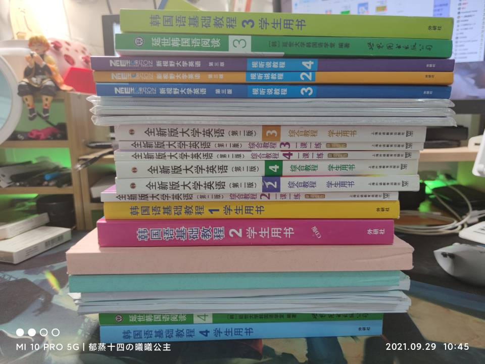

# 出二手

## 2021/09/29

如无特殊说明5r/本，10r/3本

### 英语

- [ ] 大学英语综合教程2
- [x] 大学英语综合教程2一课一练 3r
- [x] 大学英语综合教程2长篇阅读 2r
- [ ] 大学英语综合教程2视听说教程 2r
- [ ] 大学英语综合教程3
- [x] 大学英语综合教程3一课一练 3r
- [x] 大学英语综合教程3长篇阅读 2r
- [ ] 大学英语综合教程3视听说教程 2r
- [ ] 大学英语综合教程4
- [x] 大学英语综合教程4一课一练 3r
- [x] 大学英语综合教程4长篇阅读 2r
- [ ] 大学英语综合教程4视听说教程 2r

### 韩语

- [ ] 东北亚历史与文化ppt打印及期末整理 3r
- [ ] 朝鲜韩国概况ppt打印 3r
- [ ] 韩国语基础教程1
- [ ] 韩国语基础教程2
- [ ] 延世韩国语阅读3
- [ ] 韩国语基础教程3
- [ ] 延世韩国语阅读4
- [ ] 韩国语基础教程4

### 其他

- [ ] 军事理论材料1整份 2r
- [ ] 全新近现代史2019题库 3r
- [ ] 计算思维题库（仅做第一套） 3r

### 思政

- [ ] 近现代史纲要
- [ ] 思想道德修养与法律基础
- [ ] 马克思主义基本原理概论
- [ ] 毛泽东思想与与中国特色社会注意理论体系概论

### PDF

2r/本

- 金蝶ERP-K3模拟实战-财务供应链生产制造 北京市：人民邮电出版社_2011.01_何亮，龚中华，付松广编著
- 数学物理方法
- 文章学通论
- 现代汉语上 增订6版
- 现代汉语下 增订6版
- 植物学 第2版
- 延世韩国语阅读4
- 韩国语基础教程4
- 大学韩国语4
- 大学韩国语5
- 延世韩国语阅读5

另可ISBN代找PDF，4r/本

