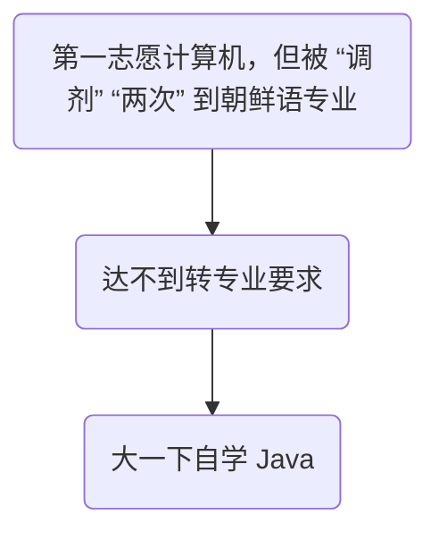
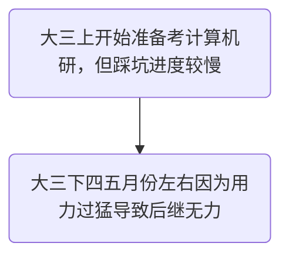
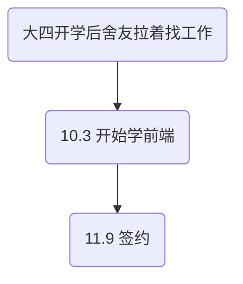
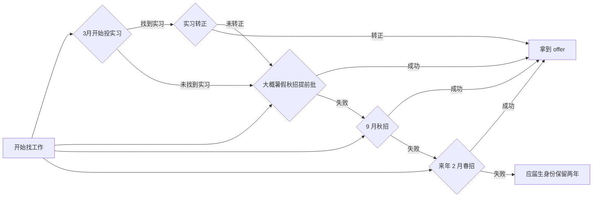

# 就业分享

[TOC]

## 个人介绍

| 姓名         | 吕晨曦                                               |
| ------------ | ---------------------------------------------------- |
| 班级         | 19朝语02                                             |
| 单位         | 众阳健康科技集团有限公司                             |
| 岗位         | 前端开发工程师                                       |
| 主要工作内容 | 前端架构与基建，解决业务方技术问题，偶尔参与业务开发 |

## 心路历程

### 大一

### 大三

### 大四

### 找工作

### 感受

就业形势严峻，但不是没有机会，结果不一定会比考研差

> 看简历面试

## 注意点

### ⚠️ 海投

确定好方向后不用关心太多岗位相关的门槛，HR 会进行筛选，将自己宝贵的时间成本转移给 HR（

> 但是如果过的简历没有多少的话，也要考虑是否与要求差距过大

### ⚠️ 多面试

第一次面试：紧张，心率飙到 200 &rarr; 数场面试之后临场能力提升巨大

> ✅ 面试安排：小厂（踏板） &rarr; 中厂（可以接受的） &rarr; 大厂（白月光）
>
> ​	逐步积累经验，根据前面的反馈对后续进行调节
>
> ​	⚠️ 不要拖太久，offer 有时限（ `福建博思` offer 期限 7 天）

### ❗️简历

敲门砖，参考知乎小红书等平台的建议

[看个案例](file:///Users/yuzheng14/Documents/应聘Web前端开发_吕晨曦_山东大学_18554208685.pdf)

[修改版](file:///Users/yuzheng14/Documents/修订版应聘Web前端开发_吕晨曦_山东大学_18554208685.pdf)

### ✅ 劳逸结合

不要逼自己太紧，经常运动，留有一定娱乐时间

> 👤 反面案例：二三四月份几乎一天学习10H+，用力过猛后继无力
>
> 
>
> 印象中最多一天 15 H 但找不到记录了
>
> -> 学会留白

### ❗️把握时间

### ⚠️ 问清工作情况

- 加班情况

- 福利

- 五险一金以及公司和个人缴纳比例

- 能否实习（考虑后续毕业实习）

  > e.g.:  `福建博思` 北京 4k/月 | 福建 3k/月，👤 实习是转正后的 80%（相当于试用期）

- 工作内容（具体业务）

- 所在团队（去互联网打探风评）

- 公司规章制度

  > 
