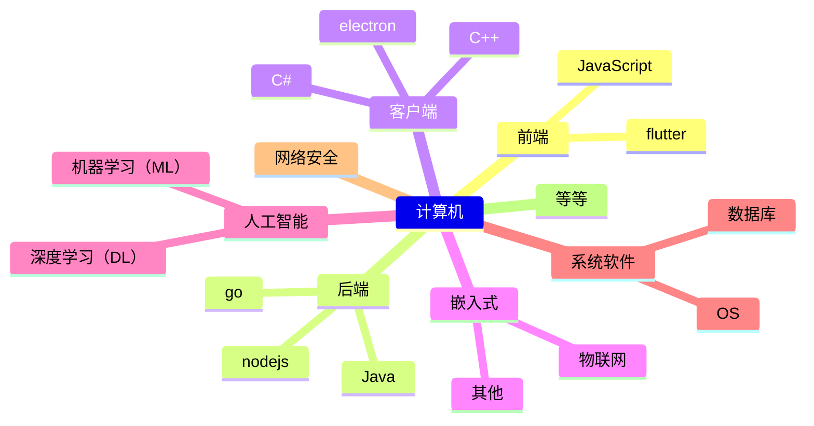
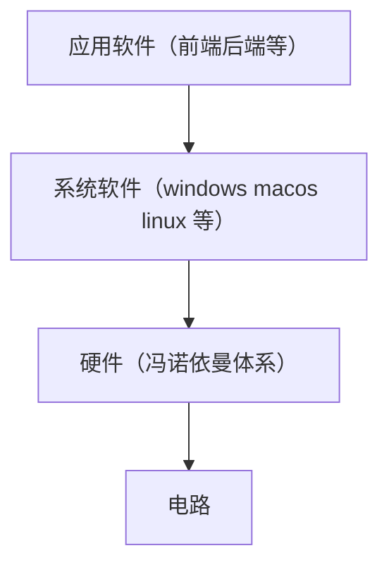

# 转码经验分享

[TOC]

## 计算机相关介绍

### 计算机方向

### 计算机层次

前三层为 computer science，后两层为 electronic engineering

### 学习顺序

硬基本功：**英语** e.g.: [Node.js (nodejs.org)](https://nodejs.org/zh-cn)

应用 &rarr; 原理

#### 编程语言（应用）

- Java
  - [How2J 的 Java教程](https://how2j.cn/?p=152524)
  - 《Java 核心技术》
- python
  - [Python 教程 — Python 3.11.4 文档](https://docs.python.org/zh-cn/3/tutorial/)
  - [Python3 教程 | 菜鸟教程 (runoob.com)](https://www.runoob.com/python3/python3-tutorial.html)
- JavaScript（前端）
  - Html、css
    - [响应式网页设计 认证 | freeCodeCamp.org](https://www.freecodecamp.org/chinese/learn/2022/responsive-web-design/)
  - javascript
    - [现代 JavaScript 教程](https://zh.javascript.info/)（领导推荐）
    - 《JavaScript 权威指南》（红皮的）
  - 框架（二选一即可）
    - vue
      - [Vue.js - 渐进式 JavaScript 框架 | Vue.js (vuejs.org)](https://cn.vuejs.org/)
    - react
      - [React](https://zh-hans.react.dev/)
- JavaScript（后端）
  - nodejs
    - [Node.js (nodejs.org)](https://nodejs.org/zh-cn)

  - 框架
    - express
    - Koa
    - nestjs
    - Eggjs

#### 原理

考研科目 408 为计算机通用基础

- 数据结构
  - 《大话数据结构》

- 计算机网络
  - 《计算机网络：自顶向下方法》

- 计算机组成原理
  - CMU 15-213（《深入理解计算机系统》）

- 操作系统
  - 《现代操作系统》

此外可以根据自己想走的方向具体进行学习

⚠️有时间一定要跟着国外优秀公开课进行学习

推荐从这个网站里面找对应的课程 [CS自学指南 (csdiy.wiki)](https://csdiy.wiki/)

#### 周边生态

[MIT | The Missing Semester of Your CS Education (mit.edu)](https://missing.csail.mit.edu/)

git & github

Linux (+shell)

## FAQ

### 如何找到合适的实习/实践机会？

韩语文学相关不太了解，根据舍友找找实习经历，基本都要求实习6个月及以上。

计算机则多关注各个公司官网，计算机招实习生还挺多的，待遇也还可以。

e.g.: [岗位投递 | 腾讯校招 (qq.com)](https://join.qq.com/post.html?pid=2&query=p_2)

### 是否应该选择双学位？

双学位相对第一学位要水一些，但是对于转不了相应专业的人来说是个机会。还是要看个人规划进行决定。

### 韩语不好就业

雀食。

靠韩语基本上就只能考公考编体制内，其他比较好的工作机会较少。

可以拓展自身能力，通过其他方面能力寻找工作。

### 韩语专业就业方向，跨考方向

985牌子在，基本上都还是可以的。

跨考除了明确要求接收专业外，都可以考。

以计算机为例，除了浙大明确要求理工科部分专业出身外，其余985无明确要求。

### 关于辅修和转专业利弊

#### 辅修

利：多学一门学科，且不延长毕业时间

弊：相较于第一学位较水，占用周末和假期时间

#### 转专业

利：可以转到喜欢/好就业的专业，且不用浪费时间在自己不想学的专业

弊：平转会相对较累，大一所学课程除了公共课作废。降转会多浪费一年时间。
