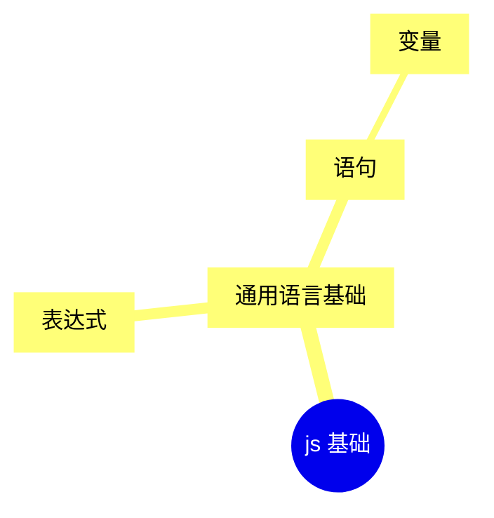
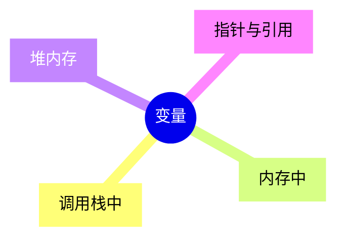

# 培训计划

## 基础

### js 基础



编程语言里面所有的语句无非就两种：

* expression 表达式
* statement 语句

关于这两者的区分，以下来自 chatGPT4 回答：

```markdown
In programming, the terms "expression" and "statement" have distinct meanings, and understanding the difference between them is fundamental:

### Expression
An **expression** is any sequence of code that evaluates to a value. Expressions produce at least one value and can be as simple as a single literal value or as complex as a series of operations on multiple operands. Here are some examples of expressions:
- `5`
- `x + 10`
- `"Hello, world!"`

Expressions can be part of statements, function arguments, and even other expressions. The key characteristic of an expression is that it results in a value and can usually be used wherever a value is expected.

### Statement
A **statement**, on the other hand, performs an action. Unlike expressions, statements do not return a value. They are the basic building blocks of a program that make up the executable code and control the execution flow. Examples of statements include:
- Variable declarations (e.g., `int x;`)
- Assignment operations (e.g., `x = 5;`)
- Control flow statements (e.g., `if`, `for`, `while`)

Statements can contain expressions (e.g., the expression `x + 10` in the assignment statement `y = x + 10;`), but they do more than just evaluate to a value—they also perform some kind of operation that changes the state of the program or affects the program's execution flow.

### Key Differences
- **Return Value**: Expressions always produce a value; statements do not necessarily produce a value but execute some action.
- **Usage**: Expressions are often part of statements; they can be used wherever a value is needed. Statements, however, cannot be part of expressions, as they do not resolve to a value.

Understanding these differences helps clarify how various elements in a programming language fit together to form coherent, functioning programs.
```

简单来说，表达式代表一个值，语句则是代码的行为，如流程控制、变量声明等

#### 表达式

很多东西都可以是表达式

* 已有的变量，如 `x`

* 算式，如 `x + 5`

* 字面量，如 `{ a: 1 }`

* **函数调用**，如 `console.log(111)`

  > Q: 为什么函数调用可以是一个表达式呢？
  >
  > A: 因为函数调用会有返回值，无论这个值是字符串、数字、undefined 还是 void（无返回值），都可以用这个函数调用的返回值去取代这里的函数调用

> Q: 讲一下 `add(m)(n)` 是个什么东西

#### 语句

语句也可以有很多种，甚至表达式本身也是一种语句

* 表达式
* 变量声明
* 赋值
* 流程控制（`if` `while` `for` `switch` 等）

#### 变量

也工作了小半年了变量是什么就不用多说了，就讲讲在计算机的视角变量是什么东西吧



