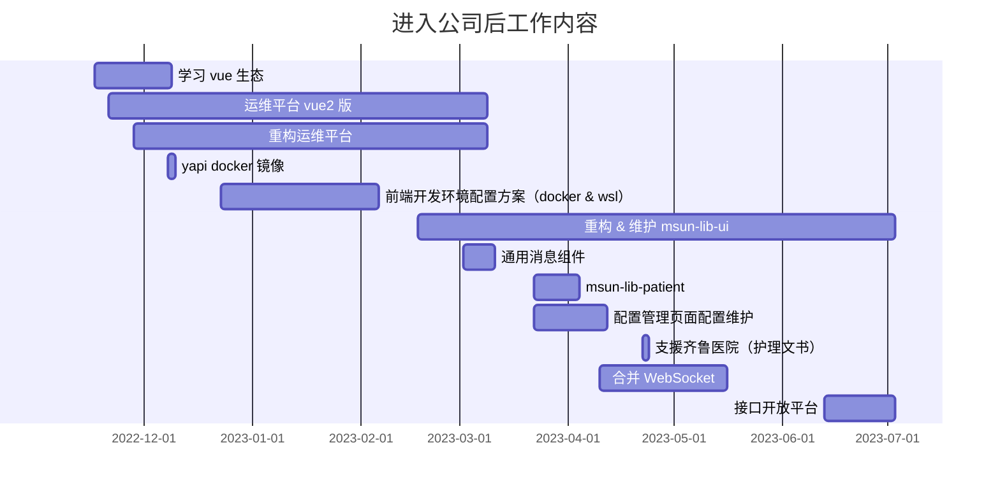
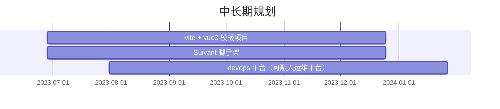

# 述职评审

初次之外零散任务：

- 文档维护
- vite + Vue + ts 模板
- 解决业务方各种前端问题

## 完成工作

### 学习 vue 生态

S：进公司前主要学习使用的 react 生态，但是公司主要使用的 vue 生态，所以需要对 vue 生态进行学习

T：对 vue 2&3 vue-router pinia 进行学习

A：总共使用约两周时间将这三门技术学习完毕

R：学习后迅速将其应用到运维平台维护和重构中去

### 维护运维平台

S：运维平台是技术中台组内部主要的前端业务项目之一，处于不断迭代之中，对于新人来说是个很好的融入开发的项目，并且可以缓解运维平台的人力紧张。

T：比较大的需求有：补丁升级灰度权限下发，nacos 维护页面

A：通过阅读相关源码，知悉修改相关上下文和模板项目信息，精准找到修改位置，完成需求，并根据自己的理解对需求细化优化

R：顺利完成运维平台维护的需求

### 重构运维平台

S：目前运维平台基于 vue2 + js 技术开发，vue2 目前已经不再进行维护，且纯 js 也不利于中大型前端项目维护

T：将运维平台的 vue2 升级为 vue3，并且加入 ts

A：参考 `element-admin` `vben` `ant-design-vue-pro` 等模板项目，总结经验，对运维平台的架子进行升级并优化，同时加入 ts，以提高可维护性。

R：重构运维平台已处于随时可用的状态，但是由于运维平台前端人力不足，导致无法将 vue2 版运维平台的页面重构的重构版上，遂处于弃用状态。但是近期 vue3 模板项目规划提上日程，已处于前期调研状态，这个项目的大部分代码都可复用。虽然对运维平台没有起到很大的作用，但是工作结果几乎可以被继承下来。

### yapi docker 镜像

S：在运维平台的需求开发中，由于前后端同时开发，前端开发时无法使用真实的接口进行自测，导致在后端接口开发完成后才能进行完善的自测，一定程度上影响了开发进度，所以需要 mock 接口进行开发，在经过一定调研后选择了 yapi 平台。

T：写一份可于公司内网部属的 yapi 服务 docker 镜像

A：参考 yapi 官方资料和 docker 镜像，学习 dockerfile 写法，将 yapi 三方镜像的前后端镜像合二为一，并进行部属

R：成功将 yapi 服务部属到公司内网，并在自己维护运维平台过程中 mock 接口进行开发，加快了开发进度。

### 前端开发环境配置（docker 镜像 &  脚本）

S：架构组中发现的一些比较好用优秀的工具由于安装配置等成本，不容易推广到公司内部，于是决定通过某种方式配置好前端的开发环境，将优秀的工具全部配置好，经调研后选择了 docker 镜像的方式，后又由于性能原因补充了 wsl 方案。

T：通过 dockerfile 和 bash shell，一键配置好需要的前端环境。

A：学习 dockerfile 和 bash shell 写法，将基础工具和前端常用好用的工具 —— `apt 镜像源` `中文语言包` `git` `curl` `wget` `zsh` `oh-my-zsh` `nvm` `nrm` `python2.7` `vim` `yarn` `pnpm` —— 等工具配置好，同时 nrm 加好 npm 私服的三个地址。

R：在公司内部有一定的使用人群，但由于业务方开发压力大，使用人群并不多。但在新人身上使用很广泛，原来需要半天到数天的环境配置，现在只需要一两分钟即可，大大降低的开发环境配置的门槛。

### 重构 & 维护 msun-lib-ui

S：老架构的 msun-lib-ui 是从 element-ui 迁移过来的一套架构，这套架构已经比较老了，产物为 commonJS 版本，已经不满足现在 esmodule 的需求，无法进行 treeshaking，而又由于需要缩小各业务方的打包产物体积，所以需要对 msun-lib-ui 进行架构更换。此外，同时维护 v0 高版本和低版本已经力不从心，需要对 v0 高低版本进行合并。同时也负责 msun-lib-ui 的日常维护。

T：更换为 rollup 打包 msun-lib-ui

A：通过学习 rollup 官方，分析 msun-base 项目，和网上的经验贴，更换 msun-lib-ui 的打包架构。同时为了方便自测，调研并学习了 monorepo，引入 msun-lib-ui 中。

R：成功更换 msun-lib-ui 的架构，并且将 v0 高低版本合一，将 msun-lib-ui 升级到 v1 大版本。其中引入的 monorepo 已经广泛在架构组的产品中进行使用，未来也将运用到向业务方推广的项目中去。

### 通用消息组件

S：王凯在几乎开发完初版通用消息组件后，由于学校课程原因返校了，但是有些需求没有开发完成，于是接手项目继续进行开发。

T：主要需求为支持有 traceId 时自动复制，和配置 type 用于选择类型。

A：修改遗留的 ts 类型问题，完善类型定义，并且修改为 monorepo 以方便测试。参考 element-ui 的使用文档撰写通用消息组件的使用文档。开发完成后进行提测。

R：<咱也不知道后续使用状况如何>

### msun-lib-patient

S：因为张国浩被静配组借调走，系统管理只剩下一个前端，人力严重不足，故被借调走维护 msun-lib-patient msun-lib-common msun-middle-front-common 三个项目

T：msun-lib-patient 主要是更换新版读卡组件和一系列其他小需求。

A：阅读读卡组件等的交接文档，以及其他组的升级经验，完成读卡组件升级，并落使用文档，并修复一系列小 bug。

R：<这个感觉没啥说的>

### msun-lib-common 和 msun-middle-front-common

S：这两个项目主要是维护配置管理页面，这个页面由于各个业务方的配置都托管在这里，所以其他业务方需要维护配置的话，都需要经过系统管理进行维护。

T：负责其他业务方代码 mr 审核及合并

A：学习 gitlab merge template，简化管理难度，并积极探索组件包的发版管理模式。

R：对于实际业务中的组件开发架构及发版流程构建有了一定的了解，对组件发版流程规划有了业务层面上的理解，将对后续 devops 平台开发起到一定的参考意义，

### 合并 WebSocket

S：由于 WebSocket 连接过多，网关服务器压力过大，故决定对一个页面内的 WebSocket 连接进行合并，以缩小网关服务器的压力。

T：开发一套 WebSocket，提供给其他业务方使用，减小其心智负担，并减小网关服务器压力。

A：运用适配器模式，对 WebSocket 进行拆分，保留了可拓展性，并且完成此次迭代需求。

R：理论上一个页面能精简到一到两个 WebSocket 连接，将大大减低网关服务器的压力。目前 msun-core-message 已经改造完成，电子病历也已经接入，将在 40 迭代进行发版，其他团队也在陆续接入当中。将根据妇幼的接入效果和使用情况进行优化。

### 接口开放平台

S：由于三方服务接口和云健康服务接口数据不一致，所以有了接口小组专门维护兼容。但日益增加的维护需求也有些力不从心，所以搭建开发平台这个低代码平台，用于快速对接三方服务接口和云健康服务接口

T：主要负责 renderer 前端页面、主进程、渲染进程的部分需求。

A：renderer 前端主要完成了 bff 控制面板，导出 bff 按钮；主进程加载 vue-devtools 用于调试，解决 Mac 环境打包后无法通过 pm2 启动 bff 的问题。以及调整文件元数据存储的数据结构，据此调整主进程、渲染进程、renderer 前端的代码。此外还完成了类型共享，提供了系统的健壮性，减少 bug 的产生。

R：<A 差不多说完了吧>

## 未来规划

目前比较大的规划有：vue3 升级规划、vite + vue3 模板项目、从 vite + vue3 模板项目拆分出来的 Suivant 脚手架、devops 平台、埋点平台。

目前 vite + vue3 模板项目和 Suivant 脚手架已经进入了前期调研阶段