# 配方大全

## 铁块


熔炉


## 磁铁


熔炉

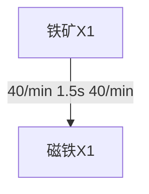

## 铜块


熔炉

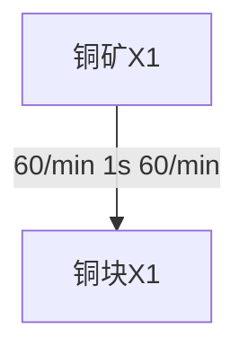

## 石材


熔炉

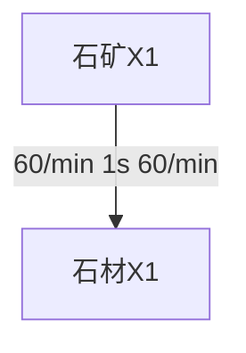

## 硅石


熔炉

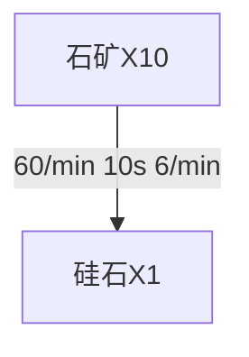


## 钛块


熔炉


## 钢材


熔炉

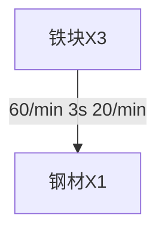

## 齿轮


制造台

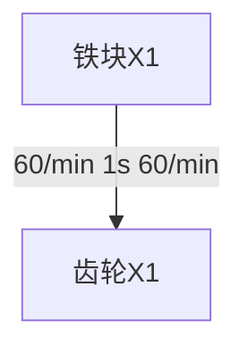

## 高纯硅块


熔炉

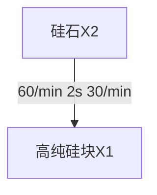

## 磁线圈


制造台

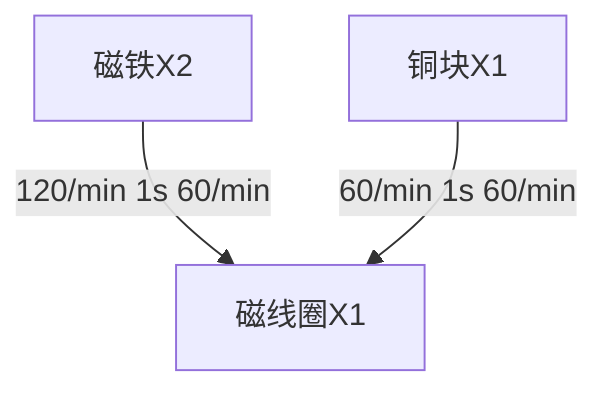

## 电路板


制造台

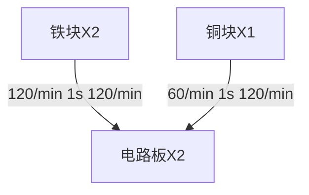

## 高能石墨


熔炉

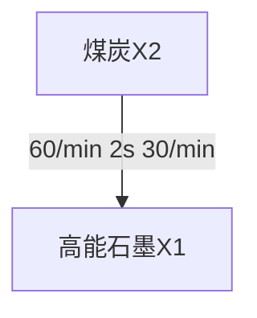

精炼厂

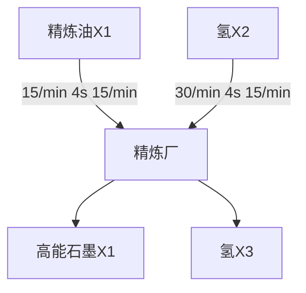

## 精炼油


精炼厂

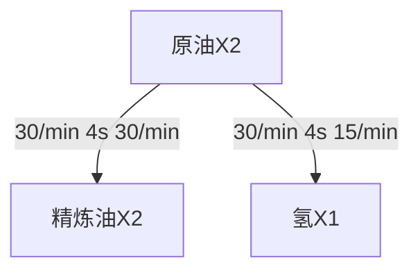

## 硫酸


化工厂

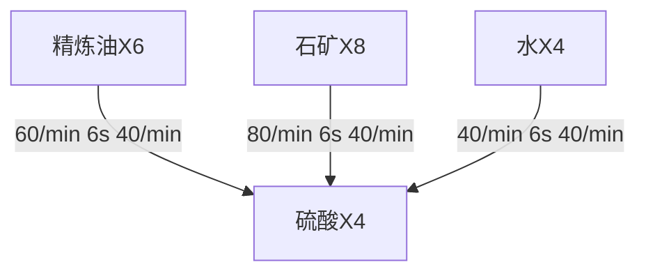

## 钛合金


熔炉

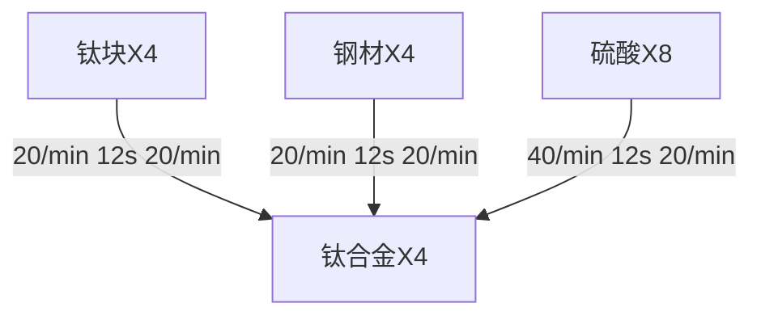

## 电动机


马达

制造台

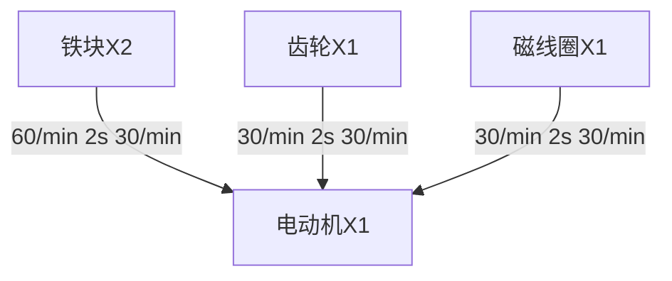

## 电磁涡轮


绿马达

制造台

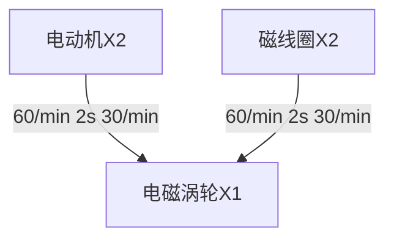

## 超级磁场环


制造台

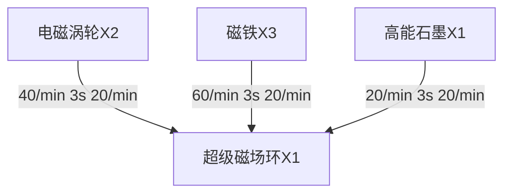

## 石墨烯


化工厂

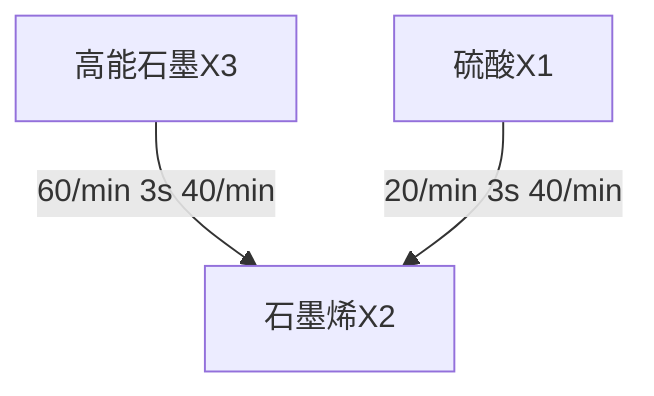

## 微晶元件


制造台

```mermaid
flowchart TD
	高纯硅块[高纯硅块X2]--60/min 2s 30/min-->微晶元件[微晶元件X1]
	铜块[铜块X1]--30/min 2s 30/min-->微晶元件
```

## 处理器


制造台

```mermaid
flowchart TD
	电路板[电路板X2]--40/min 3s 20/min-->处理器[处理器X1]
	微晶元件[微晶元件X2]--40/min 3s 20/min-->处理器
```

## 粒子容器


制造台

```mermaid
flowchart TD
	电磁涡轮[电磁涡轮X2]--30/min 4s 15/min-->粒子容器[粒子容器X1]
	铜块[铜块X2]--30/min 4s 15/min-->粒子容器
	石墨烯[石墨烯X2]--30/min 4s 15/min-->粒子容器
```

## 地基


制造台

```mermaid
flowchart TD
	石材[石材X3]--180/min 1s 60/min-->地基[地基X1]
	钢材[钢材X1]--60/min 1s 60/min-->地基
```

## 电力感应塔


制造台

```mermaid
flowchart TD
	铁块[铁块X2]--120/min 1s 60/min-->电力感应塔[电力感应塔X1]
	磁线圈[磁线圈X1]--60/min 1s 60/min-->电力感应塔
```

## 采矿机


制造台

工作功率：420kW

```mermaid
flowchart TD
	铁块[铁块X4]
	电路板[电路板X2]
	磁线圈[磁线圈X2]
	齿轮[齿轮X2]
	采矿机[采矿机X1]
	铁块--80/min 3s 20/min-->采矿机
	电路板--40/min 3s 20/min-->采矿机
	磁线圈--40/min 3s 20/min-->采矿机
	齿轮--40/min 3s 20/min-->采矿机
```

## 风力涡轮机


制造台

```mermaid
flowchart TD
	铁块[铁块X6]--90/min 4s 15/min-->风力涡轮机[风力涡轮机X1]
	齿轮[齿轮X1]--15/min 4s 15/min-->风力涡轮机
	磁线圈[磁线圈X3]--45/min 4s 15/min-->风力涡轮机
```

## 太阳能板


制造台

发电功：360kW

```mermaid
flowchart TD
	太阳能板[太阳能板X1]
	铜块[铜块X10]
	高纯硅块[高纯硅块X10]
	电路板[电路板X5]
	铜块--100/min 6s 10/min-->太阳能板
	高纯硅块--100/min 6s 10/min-->太阳能板
	电路板--50/min 6s 10/min-->太阳能板
```


## 大型储物箱


制造台

```mermaid
flowchart TD
	钢材[钢材X8]--120/min 4s 15/min-->大型储物箱[大型储物箱X1]
	石材[石材X8]--120/min 4s 15/min-->大型储物箱
```

## 制造台Mk.1


制造台

```mermaid
flowchart TD
	铁块[铁块X4]--120/min 2s 30/min-->mk1[制造台Mk.1X1]
	齿轮[齿轮X8]--240/min 2s 30/min-->mk1
	电路板[电路板X4]--120/min 2s 30/min-->mk1
```

## 制造台Mk.2


制造台

```mermaid
flowchart TD
	制造台Mk1[制造台Mk.1X1]--20/min 3s 20/min-->制造台Mk2[制造台Mk.2X1]
	石墨烯[石墨烯X8]--160/min 3s 20/min-->制造台Mk2
	处理器[处理器X4]--80/min 3s 20/min-->制造台Mk2
```

## 电弧熔炉


制造台

```mermaid
flowchart TD
	铁块[铁块X4]--80/min 3s 20/min-->furnace[电弧熔炉X1]
	石材[石材X2]--40/min 3s 20/min-->furnace
	电路板[电路板X4]--80/min 3s 20/min-->furnace
	磁线圈[磁线圈X2]--40/min 3s 20/min-->furnace
```

## 传送带


制造台

```mermaid
flowchart TD
	铁块[铁块X2]--120/min 1s 180/min-->传送带[传送带X3]
	齿轮[齿轮X1]--60/min 1s 180/min-->传送带
```

## 高速传送带


制造台

```mermaid
flowchart TD
	传送带[传送带X3]--180/min 1s 180/min-->高速传送带[高速传送带X3]
	电磁涡轮[电磁涡轮X1]--60/min 1s 180/min-->高速传送带
```

## 极速传送带


制造台

```mermaid
flowchart TD
	高速传送带[高速传送带X3]--180/min 1s 180/min-->极速传送带[极速传送带X3]
	超级磁场环[超级磁场环X1]--60/min 1s 180/min-->极速传送带
	石墨烯[石墨烯X1]--60/min 1s 180/min-->极速传送带
```

## 推进器


制造台

```mermaid
flowchart TD
	钢材[钢材X2]
	铜块[铜块X3]
	推进器[推进器X1]
	钢材--30/min 4s 15/min-->推进器
	铜块--45/min 4s 15/min-->推进器
```

## 加力推进器


制造台

```mermaid
flowchart TD
	加力推进器[加力推进器X1]
	钛合金[钛合金X5]
	电磁涡轮[电磁涡轮X5]
	钛合金--50/min 6s 50/min-->加力推进器
	电磁涡轮--50/min 6s 50/min-->加力推进器
```

## 物流运输机


制造台

```mermaid
flowchart TD
	铁块[铁块X5]
	处理器[处理器X2]
	推进器[推进器X2]
	物流运输机[物流运输机X1]
	铁块--75/min 4s 15/min-->物流运输机
	处理器--30/min 4s 15/min-->物流运输机
	推进器--30/min 4s 15/min-->物流运输机
```

## 星际物流运输船


制造台

```mermaid
flowchart TD
	星际物流运输船[星际物流运输船X1]
	钛合金[钛合金X10]
	处理器[处理器X10]
	加力推进器[加力推进器X2]
	钛合金--100/min 6s 10/min-->星际物流运输船
	处理器--100/min 6s 10/min-->星际物流运输船
	加力推进器--20/min 6s 10/min-->星际物流运输船
```

## 行星内物流运输站


制造台

最大充能功率 60MW

待机功率 60kW

```mermaid
flowchart TD
	钢材[钢材X40]--120/min 20s 3/min-->行星内物流运输站[行星内物流运输站X1]
	钛块[钛块X40]--120/min 20s 3/min-->行星内物流运输站
	处理器[处理器X40]--120/min 20s 3/min-->行星内物流运输站
	粒子容器[粒子容器X20]--60/min 20s 3/min-->行星内物流运输站
```

## 星际物流运输站


制造台

最大充能功率 300MW

待机功率 60kW

```mermaid
flowchart TD
	星际物流运输站[星际物流运输站X1]
	行星内物流运输站[行星内物流运输站X1]
	钛合金[钛合金X40]
	粒子容器[粒子容器X20]
	行星内物流运输站--2/min 30s 2/min-->星际物流运输站
	钛合金--80/min 30s 2/min-->星际物流运输站
	粒子容器--40/min 30s 2/min-->星际物流运输站
```

