# 量化计算

## 钛块

**单产配方**

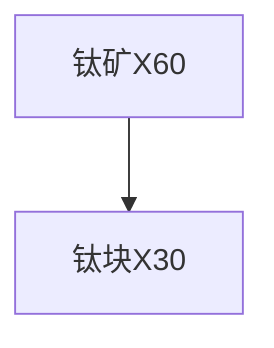
```mermaid
flowchart TD
	%% 钛块
	钛矿[钛矿X60]-->钛块[钛块X30]
```

## 钢材

**单产配方**

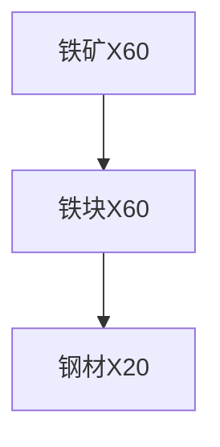
```mermaid
flowchart TD
	%% 钢材
	铁块[铁块X60]-->钢材[钢材X20]
	
		%% 铁块
		铁矿[铁矿X60]-->铁块
```

## 齿轮

**单产配方**

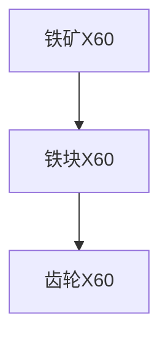
```mermaid
flowchart TD
	%% 齿轮
	铁块[铁块X60]-->齿轮[齿轮X60]
	
        %% 铁块
        铁矿[铁矿X60]-->铁块
```

## 磁线圈

**单产配方**

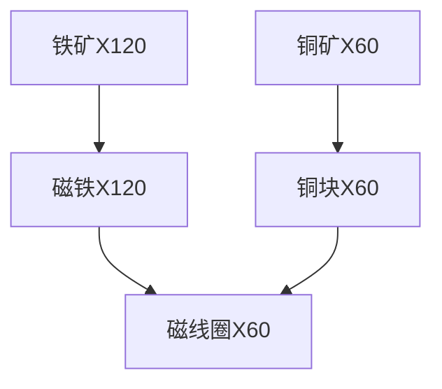
```mermaid
flowchart TD
	%% 磁线圈
	磁铁[磁铁X120]-->磁线圈[磁线圈X60]
	铜块[铜块X60]-->磁线圈
	
        %% 磁铁
        铁矿[铁矿X120]-->磁铁
        
        %% 铜块
        铜矿[铜矿X60]-->铜块
```

## 高能石墨

**单产配方**

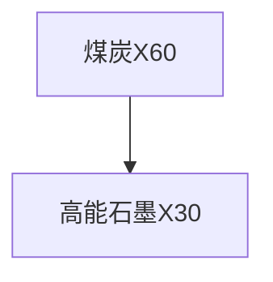
```mermaid
flowchart TD
	%% 高能石墨
	煤炭[煤炭X60]-->高能石墨[高能石墨X30]
```

## 精炼油

**单产配方**

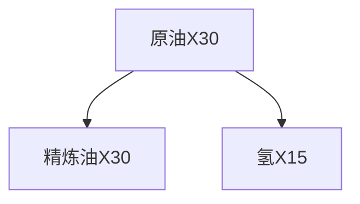
```mermaid
flowchart TD
	%% 精炼油+氢
	原油[原油X30]-->精炼油[精炼油X30]
	原油-->氢[氢X15]
```

## 硫酸

**单产配方**

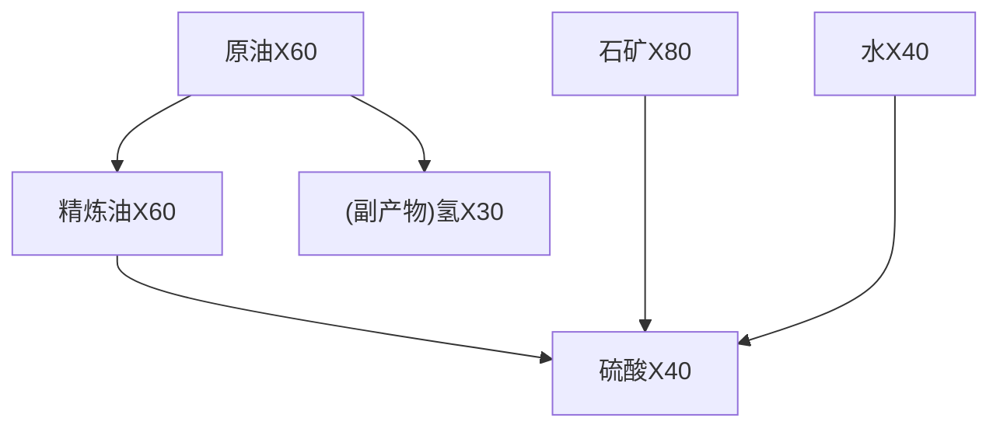
```mermaid
flowchart TD
	%% 硫酸
	精炼油[精炼油X60]-->硫酸[硫酸X40]
	石矿[石矿X80]--->硫酸
	水[水X40]--->硫酸
	
        %% 精炼油+氢
        原油[原油X60]-->精炼油
        原油-->氢["(副产物)氢X30"]
```

## 电动机

**单产配方**

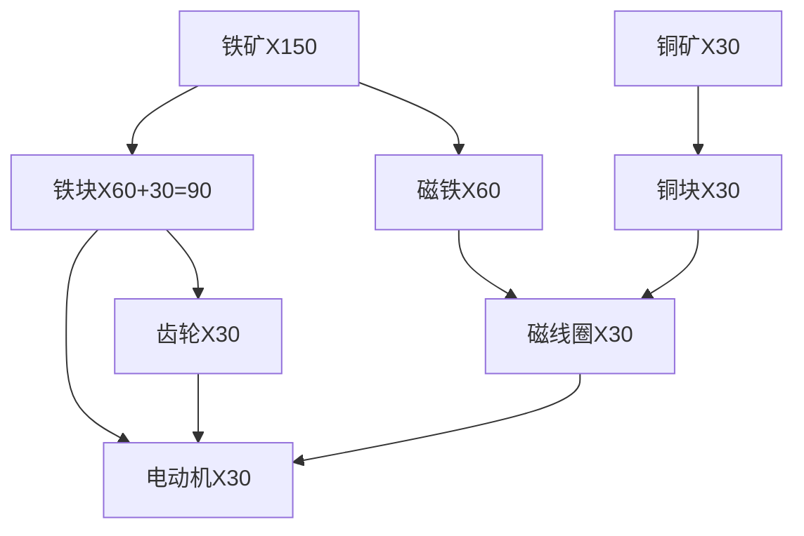
```mermaid
flowchart TD
	%% 电动机
	铁块[铁块X60+30=90]-->电动机[电动机X30]
	齿轮[齿轮X30]-->电动机
	磁线圈[磁线圈X30]-->电动机
	
        %% 铁块
        铁矿[铁矿X150]-->铁块
        
        %% 齿轮
        铁块-->齿轮
        
        %% 磁线圈
        磁铁[磁铁X60]-->磁线圈
        铜块[铜块X30]-->磁线圈
        
            %% 磁铁
            铁矿-->磁铁
            
            %%铜矿
            铜矿[铜矿X30]-->铜块
```

## 电磁涡轮

**单产配方**

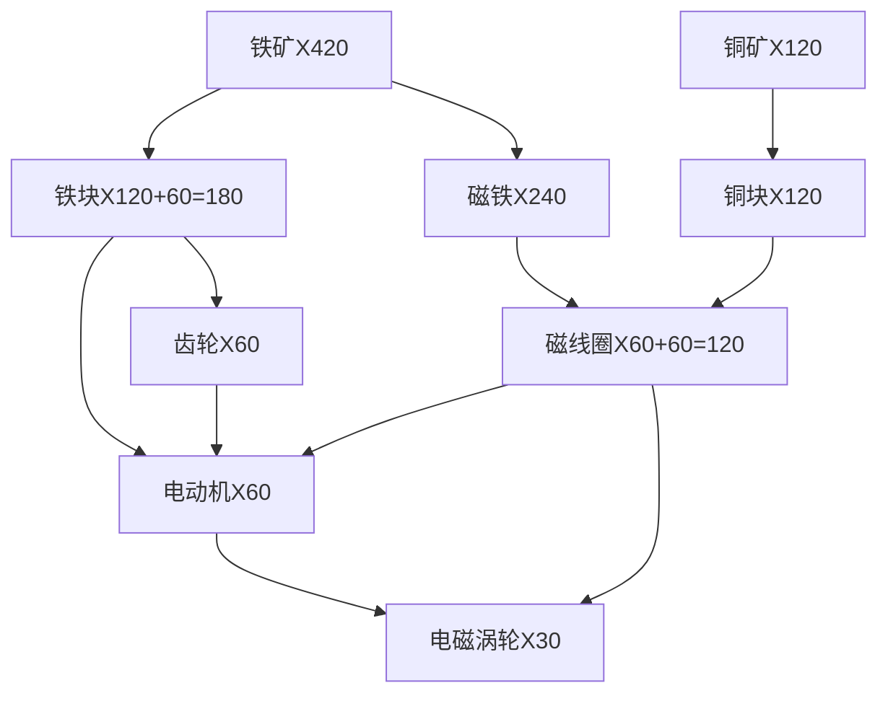
```mermaid
flowchart TD
	%%电磁涡轮
	电动机[电动机X60]-->电磁涡轮[电磁涡轮X30]
	磁线圈[磁线圈X60+60=120]-->电磁涡轮
	
		%% 电动机
        铁块[铁块X120+60=180]-->电动机
        齿轮[齿轮X60]-->电动机
        磁线圈-->电动机

			%% 铁块
            铁矿[铁矿X420]-->铁块

        	%% 齿轮
        	铁块-->齿轮

            %% 磁线圈
            磁铁[磁铁X240]-->磁线圈
            铜块[铜块X120]-->磁线圈

        		%% 磁铁
        		铁矿-->磁铁

        		%%铜块
        		铜矿[铜矿X120]-->铜块
```

## 超级磁场环

**单产配方**

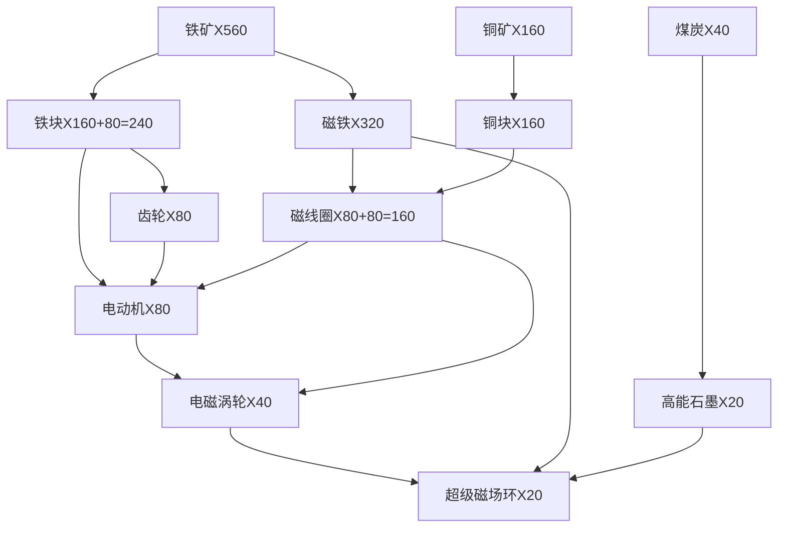
```mermaid
flowchart TD
	%% 超级磁场环
	电磁涡轮[电磁涡轮X40]-->超级磁场环[超级磁场环X20]
	磁铁[磁铁X60]-->超级磁场环
	高能石墨[高能石墨X20]-->超级磁场环

		%% 电磁涡轮
		电动机[电动机X80]-->电磁涡轮
		磁线圈[磁线圈X80+80=160]-->电磁涡轮

			%% 电动机
			铁块[铁块X160+80=240]-->电动机
			齿轮[齿轮X80]-->电动机
			磁线圈-->电动机

				%% 铁矿
				铁矿[铁矿X560]-->铁块

				%% 齿轮
				铁块-->齿轮

				%% 磁线圈
				磁铁[磁铁X320]-->磁线圈
				铜块[铜块X160]-->磁线圈

					%% 磁铁
					铁矿-->磁铁

					%%铜矿
					铜矿[铜矿X160]-->铜块

		%% 高能石墨
		煤炭[煤炭X40]----->高能石墨
```

## 石墨烯

**单产配方**

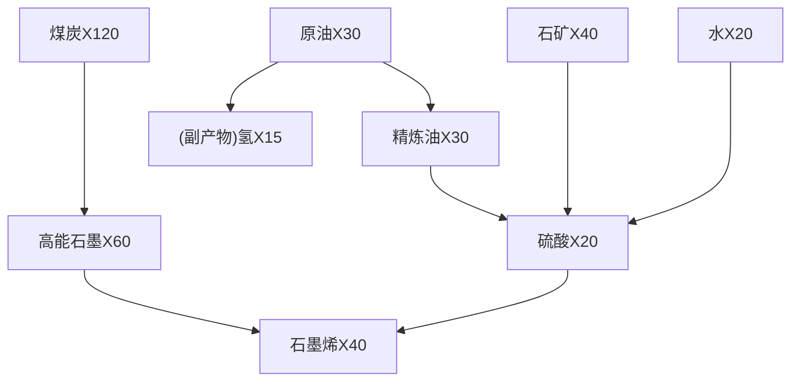
```mermaid
flowchart TD
	高能石墨[高能石墨X60]-->石墨烯[石墨烯X40]
	硫酸[硫酸X20]-->石墨烯
	煤炭[煤炭X120]--->高能石墨
	精炼油[精炼油X30]-->硫酸
	石矿[石矿X40]--->硫酸
	水[水X20]--->硫酸
	原油[原油X30]-->精炼油
	原油-->氢["(副产物)氢X15"]
```

**40/min配方**

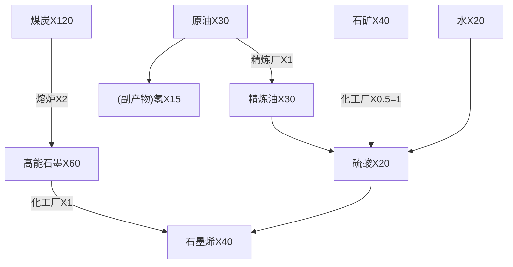
```mermaid
flowchart TD
	高能石墨[高能石墨X60]--化工厂X1-->石墨烯[石墨烯X40]
	硫酸[硫酸X20]-->石墨烯
	煤炭[煤炭X120]--熔炉X2--->高能石墨
	精炼油[精炼油X30]-->硫酸
	石矿[石矿X40]--化工厂X0.5=1--->硫酸
	水[水X20]--->硫酸
	原油[原油X30]--精炼厂X1-->精炼油
	原油-->氢["(副产物)氢X15"]
```

总计：

- 煤炭：120
- 原油：30
- 石矿：40
- 水：20
- 熔炉：2
- 化工厂：1.5=2
- 精炼厂：1

**160/min配方**

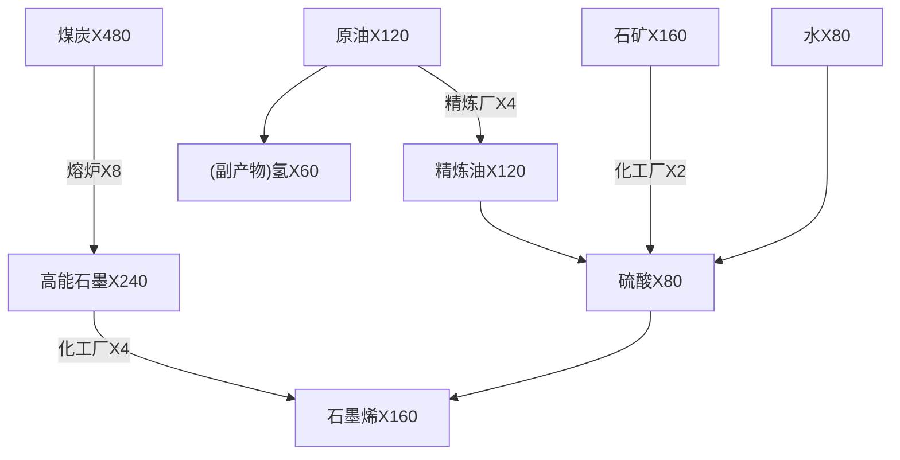
```mermaid
flowchart TD
	高能石墨[高能石墨X240]--化工厂X4-->石墨烯[石墨烯X160]
	硫酸[硫酸X80]-->石墨烯
	煤炭[煤炭X480]--熔炉X8--->高能石墨
	精炼油[精炼油X120]-->硫酸
	石矿[石矿X160]--化工厂X2--->硫酸
	水[水X80]--->硫酸
	原油[原油X120]--精炼厂X4-->精炼油
	原油-->氢["(副产物)氢X60"]
```

总计：

- 煤炭：480
- 原油：120
- 石矿：160
- 水：80
- 熔炉：8
- 化工厂：6
- 精炼厂：4

## 微晶元件

**单产配方**

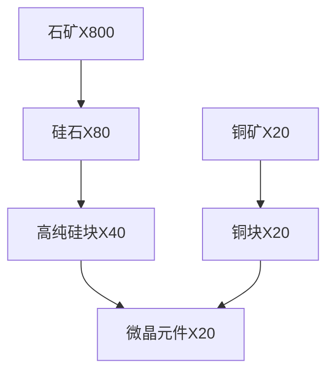
```mermaid
flowchart TD
	高纯硅块[高纯硅块X40]-->微晶元件[微晶元件X20]
	铜块[铜块X20]-->微晶元件
	硅石[硅石X80]-->高纯硅块
	石矿[石矿X800]-->硅石
	铜矿[铜矿X20]-->铜块
```

## 处理器

**单产配方**

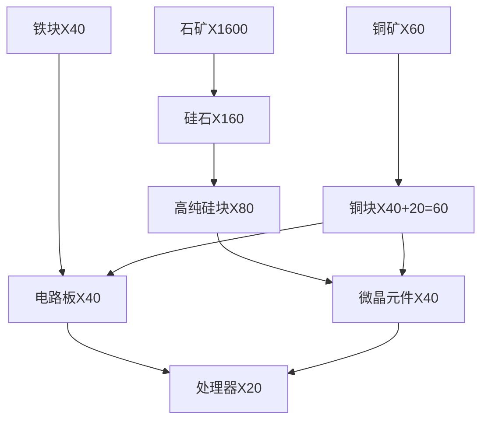
```mermaid
flowchart TD
	电路板[电路板X40]-->处理器[处理器X20]
	微晶元件[微晶元件X40]-->处理器
	高纯硅块[高纯硅块X80]-->微晶元件
	铜块[铜块X40+20=60]-->微晶元件
	硅石[硅石X160]-->高纯硅块
	石矿[石矿X1600]-->硅石
	铜矿[铜矿X60]--->铜块
	铁块[铁块X40]---->电路板
	铜块-->电路板
```

**20/min配方**

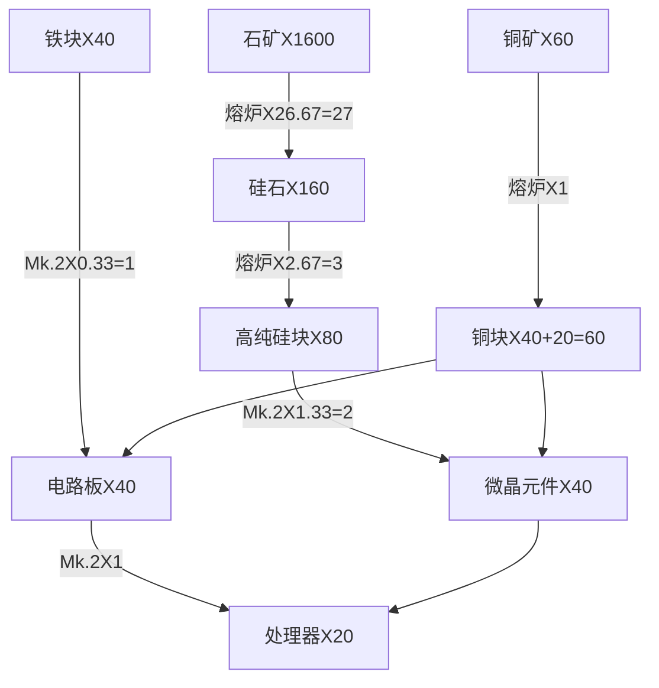
```mermaid
flowchart TD
	电路板[电路板X40]--Mk.2X1-->处理器[处理器X20]
	微晶元件[微晶元件X40]-->处理器
	高纯硅块[高纯硅块X80]--Mk.2X1.33=2-->微晶元件
	铜块[铜块X40+20=60]-->微晶元件
	硅石[硅石X160]--熔炉X2.67=3-->高纯硅块
	石矿[石矿X1600]--熔炉X26.67=27-->硅石
	铜矿[铜矿X60]--熔炉X1--->铜块
	铁块[铁块X40]--Mk.2X0.33=1---->电路板
	铜块-->电路板
```

总计：

- 铁块：40
- 石矿：1600
- 铜矿：60
- 熔炉：30.67=31（-27）
- Mk.2：1.33=2

**30/min配方**

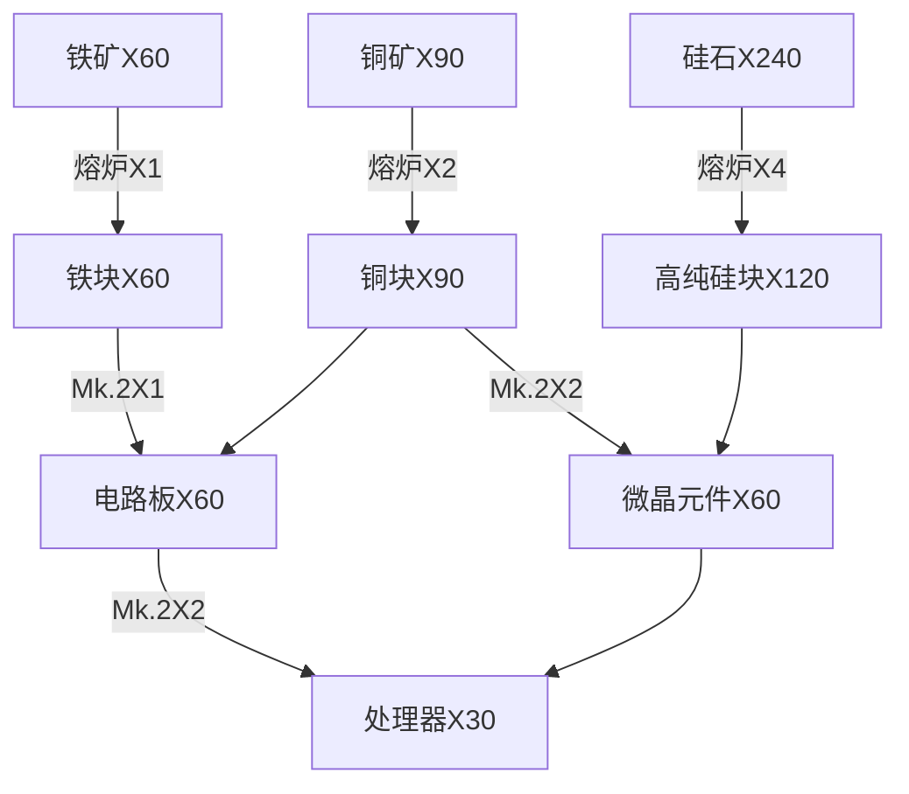
```mermaid
flowchart TD
	处理器[处理器X30]
	电路板[电路板X60]
	铁块[铁块X60]
	铁矿[铁矿X60]
	铜块[铜块X90]
	铜矿[铜矿X90]
	微晶元件[微晶元件X60]
	高纯硅块[高纯硅块X120]
	硅石[硅石X240]
	电路板--Mk.2X2-->处理器
	铁块--Mk.2X1-->电路板
	铁矿--熔炉X1-->铁块
	铜块-->电路板
	铜块--Mk.2X2-->微晶元件
	铜矿--熔炉X2-->铜块
	微晶元件-->处理器
	高纯硅块-->微晶元件
	硅石--熔炉X4-->高纯硅块
```

**120/min配方**

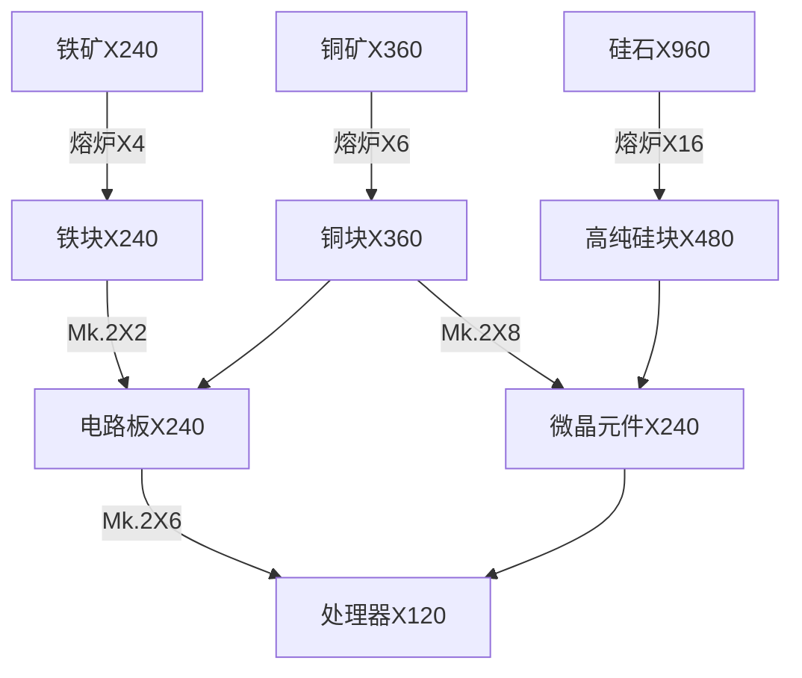
```mermaid
flowchart TD
	处理器[处理器X120]
	电路板[电路板X240]
	铁块[铁块X240]
	铁矿[铁矿X240]
	铜块[铜块X360]
	铜矿[铜矿X360]
	微晶元件[微晶元件X240]
	高纯硅块[高纯硅块X480]
	硅石[硅石X960]
	电路板--Mk.2X6-->处理器
	铁块--Mk.2X2-->电路板
	铁矿--熔炉X4-->铁块
	铜块-->电路板
	铜块--Mk.2X8-->微晶元件
	铜矿--熔炉X6-->铜块
	微晶元件-->处理器
	高纯硅块-->微晶元件
	硅石--熔炉X16-->高纯硅块
```

总计：

- 铁矿：240
- 铜矿：360
- 硅石：960
- 

## 粒子容器

**单产配方**

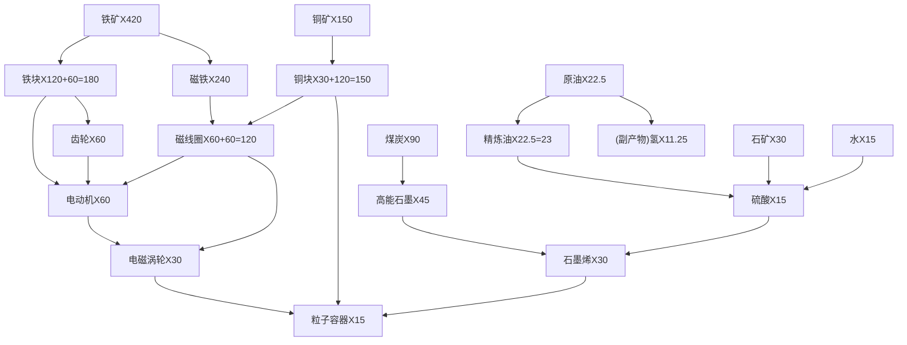
```mermaid
flowchart TD
	电磁涡轮[电磁涡轮X30]-->粒子容器[粒子容器X15]
	铜块[铜块X30+120=150]-->粒子容器
	石墨烯[石墨烯X30]-->粒子容器
	电动机[电动机X60]-->电磁涡轮
	磁线圈[磁线圈X60+60=120]-->电磁涡轮
	铁块[铁块X120+60=180]-->电动机
	齿轮[齿轮X60]-->电动机
	磁线圈-->电动机
	铁矿[铁矿X420]-->铁块
	铁块-->齿轮
	磁铁[磁铁X240]-->磁线圈
	铜块-->磁线圈
	铁矿-->磁铁
	铜矿[铜矿X150]-->铜块
	高能石墨[高能石墨X45]-->石墨烯
	硫酸[硫酸X15]-->石墨烯
	煤炭[煤炭X90]-->高能石墨
	精炼油[精炼油X22.5=23]-->硫酸
	石矿[石矿X30]-->硫酸
	水[水X15]-->硫酸
	原油[原油X22.5]-->精炼油
	原油-->氢["(副产物)氢X11.25"]
```

**60/min配方**

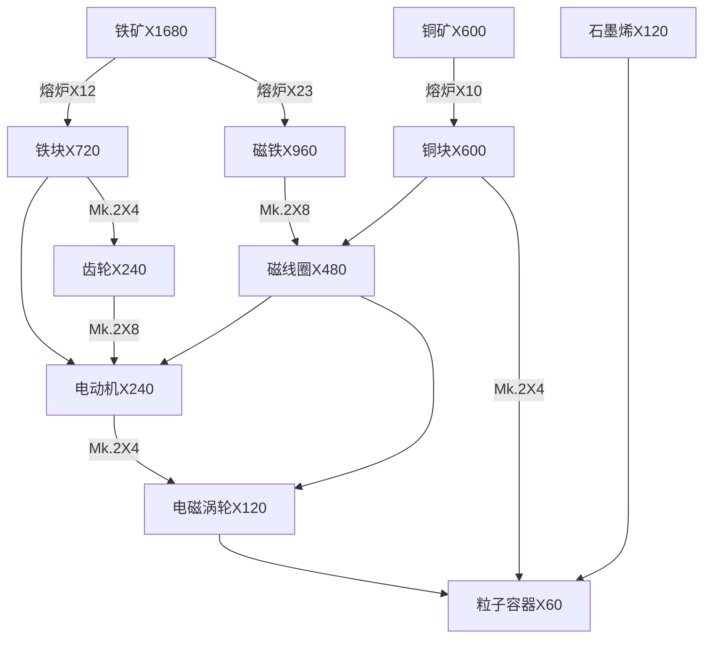
```mermaid
flowchart TD
	粒子容器[粒子容器X60]
	电磁涡轮[电磁涡轮X120]
	电动机[电动机X240]
	铁块[铁块X720]
	铁矿[铁矿X1680]
	齿轮[齿轮X240]
	磁线圈[磁线圈X480]
	磁铁[磁铁X960]
	铜块[铜块X600]
	铜矿[铜矿X600]
	石墨烯[石墨烯X120]
	电磁涡轮-->粒子容器
	电动机--Mk.2X4-->电磁涡轮
	铁块-->电动机
	铁块--Mk.2X4-->齿轮
	铁矿--熔炉X12-->铁块
	铁矿--熔炉X23-->磁铁
	齿轮--Mk.2X8-->电动机
	磁线圈-->电动机
	磁线圈-->电磁涡轮
	磁铁--Mk.2X8-->磁线圈
	铜块-->磁线圈
	铜块--Mk.2X4-->粒子容器
	铜矿--熔炉X10-->铜块
	石墨烯------>粒子容器
```

## 钛合金

**相关配方**

```mermaid
flowchart TD
	a[钛合金X4]
	b[钛块X4]
	c[钢材X4]
	d[硫酸X8]
	c-->a
	b-- 12s -->a
	d-->a
	e[钢材X1]
	f[铁块X3]
	f-- 3s -->e
	g[铁块X1]
	h[铁矿X1]
	h-- 1s -->g
	i[硫酸X4]
	j[精炼油X6]
	k[石矿X8]
	l[水X4]
	j-->i
	k--6s-->i
	l-->i
	m[原油X2]
	n[氢X1]
	o[精炼油X2]
	m-->n
	m--4s-->o
	p[抽水站]
	p--55/min-->l
```

**60/min 方案**

```mermaid
flowchart TD
	1[钛合金X60]
	2[钢材X60]
	3[钛块X60]
	4[硫酸X120]
	5[铁块X180]
	6[铁矿X180]
	7[精炼油X180]
	8[石矿X240]
	9[水X120]
	10[抽水站]
	11[原油X180]
	2-->1
	3--Mk2X3-->1
	4-->1
	5--熔炉X3-->2
	6--熔炉X3-->5
	7-->4
	8--化工厂X3-->4
	9-->4
	10--X3-->9
	11--精炼厂X6-->7
```

**200/min配方**

```mermaid
flowchart TD
	钛合金[钛合金X200]
	钛块[钛块X200]
	钛矿[钛矿X400]
	钢材[钢材X200]
	铁块[铁块X600]
	铁矿[铁矿X600]
	硫酸[硫酸X400]
	精炼油[精炼油X600]
	原油[原油X600]
	石矿[石矿X800]
	水[水X400]
	钛块-->钛合金
	钛矿-->钛块
	钢材-->钛合金
	铁块-->钢材
	铁矿-->铁块
	硫酸-->钛合金
	精炼油-->硫酸
	原油-->精炼油
	石矿-->硫酸
	水-->硫酸

```

## 碳纳米管

**600/min配方**

```mermaid
flowchart TD
	碳纳米管[碳纳米管X600]
	石墨烯[石墨烯X450]
	高能石墨[高能石墨X675]
	煤炭[煤炭X1350]
	硫酸[硫酸X225]
	精炼油[精炼油X337.5]
	原油[原油X337.5]
	石矿[石矿X450]
	水[水X225]
	钛块[钛块X150]
	钛矿[钛矿X300]
	石墨烯-->碳纳米管
	高能石墨-->石墨烯
	煤炭-->高能石墨
	硫酸-->石墨烯
	精炼油-->硫酸
	原油-->精炼油
	石矿-->硫酸
	水-->硫酸
	钛块-->碳纳米管
	钛矿-->钛块

```

## 氘核燃料棒

**100/min配方**

```mermaid
flowchart TD
	氘核燃料棒[氘核燃料棒X100]
	钛合金[钛合金X50]
	钛块[钛块X50]
	钛矿[钛矿X100]
	钢材[钢材X50]
	铁块[铁块X750]
	铁矿[铁矿X1700]
	硫酸[硫酸X100]
	精炼油[精炼油X150]
	原油[原油X150]
	石矿[石矿X200]
	水[水X100]
	重氢[重氢X1000]
	氢[氢X100000]
	超级磁场环[超级磁场环X50]
	电磁涡轮[电磁涡轮X100]
	电动机[电动机X200]
	齿轮[齿轮X200]
	磁线圈[磁线圈X400]
	磁铁[磁铁X950]
	铜块[铜块X400]
	铜矿[铜矿X400]
	高能石墨[高能石墨X50]
	煤炭[煤炭X100]
	钛合金-->氘核燃料棒
	钛块-->钛合金
	钛矿-->钛块
	钢材-->钛合金
	铁块-->钢材
	铁块-->电动机
	铁块-->齿轮
	铁矿-->铁块
	铁矿-->磁铁
	硫酸-->钛合金
	精炼油-->硫酸
	原油-->精炼油
	石矿-->硫酸
	水-->硫酸
	重氢-->氘核燃料棒
	氢-->重氢
	超级磁场环-->氘核燃料棒
	电磁涡轮-->超级磁场环
	电动机-->电磁涡轮
	齿轮-->电动机
	磁线圈-->电动机
	磁线圈-->电磁涡轮
	磁铁-->磁线圈
	磁铁-->超级磁场环
	铜块-->磁线圈
	铜矿-->铜块
	高能石墨-->超级磁场环
	煤炭-->高能石墨

```

## 地基

**60/min配方**

```mermaid
flowchart TD
	石材[石材X180]--Mk.2X1-->地基[地基X60]
	钢材[钢材X60]-->地基
	石矿[石矿X180]--熔炉X3--->石材
	铁块[铁块X180]--熔炉X3-->钢材
	铁矿[铁矿X180]--熔炉X3-->铁块
```

总计：

- 石矿：180
- 铁矿：180
- 熔炉：9
- Mk.2：1

## 电力感应塔

**60/min配方**

```mermaid
flowchart TD
	铁块[铁块X120]--Mk.2X1-->电力感应塔[电力感应塔X60]
	磁线圈[磁线圈X60]-->电力感应塔
	磁铁[磁铁X120]--Mk.2X1-->磁线圈
	铜块[铜块X60]-->磁线圈
	铁矿[铁矿X120+120=240]--熔炉X2-->铁块
	铁矿--熔炉X2-->磁铁
	铜矿[铜矿X60]--熔炉X1-->铜块
```

总计：

- 铁矿：240
- 铜矿：60
- 熔炉：5
- Mk.2：2

## 风力涡轮机

**单产配方**

```mermaid
flowchart TD
	铁块[铁块X90+15=105]-->风力涡轮机[风力涡轮机X15]
	齿轮[齿轮X15]-->风力涡轮机
	磁线圈[磁线圈X45]-->风力涡轮机
	铁块-->齿轮
	铁矿[铁矿X195]-->铁块
	磁铁[磁铁X90]-->磁线圈
	铜块[铜块X45]-->磁线圈
	铁矿-->磁铁
	铜矿[铜矿X45]-->铜块
```

**15/min配方**

```mermaid
flowchart TD
	铁块[铁块X90+15=105]-->风力涡轮机[风力涡轮机X15]
	齿轮[齿轮X15]--Mk.2X1-->风力涡轮机
	磁线圈[磁线圈X45]-->风力涡轮机
	铁块--Mk.2X0.25=1-->齿轮
	铁矿[铁矿X195]--熔炉X1.75=2-->铁块
	磁铁[磁铁X90]--Mk.2X0.75=1-->磁线圈
	铜块[铜块X45]-->磁线圈
	铁矿--熔炉X1.5=2-->磁铁
	铜矿[铜矿X45]--熔炉X0.75=1-->铜块
```

总计:

- 铁矿：195
- 铜矿：45
- 熔炉：4=5
- Mk.2：2=3

## 太阳能板

**单产配方**

```mermaid
flowchart TD
	太阳能板[太阳能板X10]
	铜块[铜块X125]
	铜矿[铜矿X125]
	高纯硅块[高纯硅块X100]
	硅石[硅石X200]
	电路板[电路板X50]
	铁块[铁块X50]
	铁矿[铁矿X50]
	铜块--Mk.2X1-->太阳能板
	铜块--Mk.2X0.42-->电路板
	铜矿--熔炉X2.08-->铜块
	高纯硅块--->太阳能板
	硅石--熔炉X3.33-->高纯硅块
	电路板-->太阳能板
	铁块-->电路板
	铁矿--熔炉X0.83-->铁块

```

## 采矿机

**单产配方**

```mermaid
flowchart TD
	采矿机[采矿机X20]
	铁块[铁块X160]
	铁矿[铁矿X240]
	电路板[电路板X40]
	铜块[铜块X60]
	铜矿[铜矿X60]
	磁线圈[磁线圈X40]
	磁铁[磁铁X80]
	齿轮[齿轮X40]
	
	铁块-->采矿机
	铁块-->电路板
	铁块-->齿轮
	铁矿-->铁块
	铁矿-->磁铁
	电路板-->采矿机
	铜块-->电路板
	铜块-->磁线圈
	铜矿-->铜块
	磁线圈-->采矿机
	磁铁-->磁线圈
	齿轮-->采矿机
```

## 制造台Mk.1

**单产配方**

```mermaid
flowchart TD
	铁块[铁块X120+240=360]-->mk1[制造台Mk.1X30]
	齿轮[齿轮X240]-->mk1
	电路板[电路板X120]-->mk1
	铁矿[铁矿X360]-->铁块
	铁块-->齿轮
	铁块-->电路板
	铜块[铜块X60]-->电路板
	铜矿[铜矿X60]-->铜块
```

**30/min配方**

```mermaid
flowchart TD
	铁块[铁块X120+240=360]-->制造台Mk1[制造台Mk.1X30]
	齿轮[齿轮X240]--Mk.2X1-->制造台Mk1
	电路板[电路板X120]-->制造台Mk1
	铁矿[铁矿X360]--熔炉X6-->铁块
	铁块--Mk.2X4-->齿轮
	铁块--Mk.2X1-->电路板
	铜块[铜块X60]-->电路板
	铜块-mine[铜矿X60]--熔炉X1-->铜块
```

总计：

- 铁矿：360
- 铜矿：60
- 熔炉：7
- Mk.2：6

## 制造台Mk.2

**单产配方**

```mermaid
flowchart TD
	制造台Mk1[制造台Mk.1X20]-->制造台Mk2[制造台Mk.2X20]
	石墨烯[石墨烯X160]-->制造台Mk2
	处理器[处理器X80]-->制造台Mk2
	铁块[铁块X80+160+160=400]-->制造台Mk1
	齿轮[齿轮X160]-->制造台Mk1
	电路板[电路板X80]-->制造台Mk1
	铁矿[铁矿X400]-->铁块
	铁块-->齿轮
	铁块-->电路板
	铜块[铜块X40+240=280]-->电路板
	铜矿[铜矿X280]-->铜块
	高能石墨[高能石墨X240]-->石墨烯
	硫酸[硫酸X80]-->石墨烯
	煤炭[煤炭X480]--->高能石墨
	精炼油[精炼油X120]-->硫酸
	石矿[石矿X160]--->硫酸
	水[水X80]--->硫酸
	原油[原油X120]-->精炼油
	原油-->氢["(副产物)氢X60"]
	电路板[电路板X160]-->处理器
	微晶元件[微晶元件X160]-->处理器
	高纯硅块[高纯硅块X320]-->微晶元件
	铜块-->微晶元件
	硅石[硅石X160]-->高纯硅块
```

**20/min配方**

```mermaid
flowchart TD
	制造台Mk1[制造台Mk.1X20]-->制造台Mk2[制造台Mk.2X20]
	石墨烯[石墨烯X160]-->制造台Mk2
	处理器[处理器X80]--Mk.2X1-->制造台Mk2
	铁块[铁块X80+160+160=400]-->制造台Mk1
	齿轮[齿轮X160]--Mk.2X0.66=1-->制造台Mk1
	电路板[电路板X80]-->制造台Mk1
	铁矿[铁矿X400]--熔炉X6.67=7-->铁块
	铁块--Mk.2X2.67=3-->齿轮
	铁块--Mk.2X1.33=2-->电路板
	铜块[铜块X40+240=280]-->电路板
	铜矿[铜矿X280]--熔炉X4.67=5-->铜块
	高能石墨[高能石墨X240]--化工厂X4-->石墨烯
	硫酸[硫酸X80]-->石墨烯
	煤炭[煤炭X480]--熔炉X8--->高能石墨
	精炼油[精炼油X120]-->硫酸
	石矿[石矿X160]--化工厂X2--->硫酸
	水[水X80]--->硫酸
	原油[原油X120]--精炼厂X4-->精炼油
	原油-->氢["(副产物)氢X60"]
	电路板[电路板X160]--Mk.2X4-->处理器
	微晶元件[微晶元件X160]-->处理器
	高纯硅块[高纯硅块X320]-->微晶元件
	铜块--Mk.2X5.33=6-->微晶元件
	硅石[硅石X160]--熔炉X10.67=11-->高纯硅块
```

总计：

- 铁矿：400
- 铜矿：280
- 煤炭：480
- 原油：120
- 石矿：160
- 水：80
- 硅石：160
- 熔炉：30=31
- Mk.2：15=17
- 精炼厂：4
- 化工厂：6

## 极速分拣器

**单产配方**

```mermaid
flowchart TD
	极速分拣器[极速分拣器X60]
	高速分拣器[高速分拣器X60]
	分拣器[分拣器X60]
	铁块[铁块X390]
	铁矿[铁矿X690]
	电路板[电路板X60]
	铜块[铜块X180]
	铜矿[铜矿X180]
	电动机[电动机X90]
	齿轮[齿轮X90]
	磁线圈[磁线圈X150]
	磁铁[磁铁X300]
	电磁涡轮[电磁涡轮X30]
	高速分拣器-->极速分拣器
	分拣器-->高速分拣器
	铁块-->分拣器
	铁块-->电路板
	铁块-->电动机
	铁块-->齿轮
	铁矿-->铁块
	铁矿-->磁铁
	电路板-->分拣器
	铜块-->电路板
	铜块-->磁线圈
	铜矿-->铜块
	电动机-->高速分拣器
	电动机-->电磁涡轮
	齿轮-->电动机
	磁线圈-->电动机
	磁线圈-->电磁涡轮
	磁铁-->磁线圈
	电磁涡轮-->极速分拣器
```

## 电弧熔炉

**20/min配方**

```mermaid
flowchart TD
	铁块[铁块X80+80=160]-->furnace[电弧熔炉X20]
	石材[石材X40]--Mk.2X1-->furnace
	电路板[电路板X80]-->furnace
	磁线圈[磁线圈X40]-->furnace
	铁矿[铁矿X160+80=240]--熔炉X4-->铁块
	石矿[石矿X40]--熔炉X0.67=1--->石材
	铁块--Mk.2X0.67=1-->电路板
	铜块[铜块X40+40=80]-->电路板
	铜块-mine[铜矿X80]--熔炉X1.33=2-->铜块
	磁铁[磁铁X80]-->磁线圈
	铜块--Mk.2X0.67=1-->磁线圈
	铁矿--熔炉X2-->磁铁
```

总计：

- 石矿：40/min
- 铁矿：240/min
- 铜矿：80/min
- 熔炉：9
- Mk.2：3

## 传送带

**单产配方**

```mermaid
flowchart TD
	%% 传送带
	铁块[铁块X180]-->传送带[传送带X180]
	齿轮[齿轮X60]-->传送带
		
		%% 铁块
		铁矿[铁矿X180]-->铁块
		
		%% 齿轮
        铁块-->齿轮[齿轮X60]
```

## 高速传送带

**单产配方**

```mermaid
flowchart TD
	%% 高速传送带
	传送带[传送带X180]-->高速传送带[高速传送带X180]
	电磁涡轮[电磁涡轮X60]-->高速传送带
```

## 极速传送带

**单产配方**

```mermaid
flowchart TD
    %% 极速传送带
    极速传送带[极速传送带X180]
    高速传送带[高速传送带X180]
    传送带[传送带X180]
    铁块[铁块X1260]
    铁矿[铁矿X2880]
    齿轮[齿轮X420]
    电磁涡轮[电磁涡轮X180]
    电动机[电动机X360]
    磁线圈[磁线圈X720]
    磁铁[磁铁X1620]
    铜块[铜块X720]
    铜矿[铜矿X720]
    超级磁场环[超级磁场环X60]
    高能石墨[高能石墨X150]
    煤炭[煤炭X300]
    石墨烯[石墨烯X60]
    硫酸[硫酸X30]
    精炼油[精炼油X45]
    原油[原油X45]
    石矿[石矿X60]
    水[水X30]
    高速传送带-->极速传送带
    传送带-->高速传送带
    铁块-->传送带 & 齿轮 & 电动机
    铁矿-->铁块 & 磁铁
    齿轮-->传送带 & 电动机
    电磁涡轮-->高速传送带 & 超级磁场环
    电动机-->电磁涡轮
    磁线圈-->电动机 & 电磁涡轮
    磁铁-->磁线圈 & 超级磁场环
    铜块-->磁线圈
    铜矿-->铜块
    超级磁场环-->极速传送带
    高能石墨-->超级磁场环 & 石墨烯
    煤炭----->高能石墨
    石墨烯-->极速传送带
    硫酸-->石墨烯
    精炼油-->硫酸
    原油---->精炼油
    石矿----->硫酸
    水----->硫酸
```

**180/min配方**

```mermaid
flowchart TD
	极速传送带[极速传送带X180]
	高速传送带[高速传送带X180]
	传送带[传送带X180]
	铁块[铁块X1260]
	铁矿[铁矿X2880]
	齿轮[齿轮X420]
	电磁涡轮[电磁涡轮X180]
	电动机[电动机X360]
	磁线圈[磁线圈X720]
	磁铁[磁铁X1620]
	铜块[铜块X720]
	铜矿[铜矿X720]
	超级磁场环[超级磁场环X60]
	高能石墨[高能石墨X60+90=150]
	煤炭[煤炭X120+180=300]
	石墨烯[石墨烯X60]
	硫酸[硫酸X30]
	精炼油[精炼油X45]
	原油[原油X45]
	石矿[石矿X60]
	水[水X30]
	高速传送带-->极速传送带
	传送带--Mk.2X1-->高速传送带
	铁块-->传送带
	铁块--Mk.2X7-->齿轮
	铁块--Mk.2X12-->电动机
	铁矿--熔炉X21-->铁块
	铁矿--熔炉X40.5=41-->磁铁
	齿轮--Mk.2X1-->传送带
	齿轮-->电动机
	电磁涡轮-->高速传送带
	电磁涡轮-->超级磁场环
	电动机--Mk.2X6-->电磁涡轮
	磁线圈-->电动机
	磁线圈-->电磁涡轮
	磁铁--Mk.2X12-->磁线圈
	磁铁--Mk.2X3-->超级磁场环
	铜块-->磁线圈
	铜矿--熔炉X12-->铜块
	超级磁场环--Mk.2X1-->极速传送带
	高能石墨-->超级磁场环
	高能石墨--化工厂X1.5=2-->石墨烯
	煤炭--熔炉X2+3=5----->高能石墨
	石墨烯-->极速传送带
	硫酸-->石墨烯
	精炼油-->硫酸
	原油--精炼厂X1.5=2---->精炼油
	石矿--化工厂X0.75=1----->硫酸
	水----->硫酸
```

总计：

- 铁矿：2880
- 铜矿：720
- 煤炭：120（+180）
- 原油：45
- 石矿：60
- 水：30
- 熔炉：75.5=76（+3）
- Mk.2：43
- 化工厂：2.25=3
- 精炼厂：1.5=2

**30/min配方**

```mermaid
flowchart TD
	极速传送带[极速传送带X30]
	高速传送带[高速传送带X30]
	传送带[传送带X30]
	铁块[铁块X210]
	铁矿[铁矿X480]
	齿轮[齿轮X70]
	电磁涡轮[电磁涡轮X30]
	电动机[电动机X60]
	磁线圈[磁线圈X120]
	磁铁[磁铁X270]
	铜块[铜块X120]
	铜矿[铜矿X120]
	超级磁场环[超级磁场环X10]
	高能石墨[高能石墨X10+15=25]
	煤炭[煤炭X20+30=50]
	石墨烯[石墨烯X10]
	硫酸[硫酸X5]
	精炼油[精炼油X7.5]
	原油[原油X7.5]
	石矿[石矿X10]
	水[水X5]
	高速传送带-->极速传送带
	传送带--Mk.2X0.17=1-->高速传送带
	铁块-->传送带
	铁块--Mk.2X1.17=2-->齿轮
	铁块--Mk.2X2-->电动机
	铁矿--熔炉X3.5=4-->铁块
	铁矿--熔炉X6.75=7-->磁铁
	齿轮--Mk.2X0.17=1-->传送带
	齿轮-->电动机
	电磁涡轮-->高速传送带
	电磁涡轮-->超级磁场环
	电动机--Mk.2X1-->电磁涡轮
	磁线圈-->电动机
	磁线圈-->电磁涡轮
	磁铁--Mk.2X2-->磁线圈
	磁铁--Mk.2X0.5=1-->超级磁场环
	铜块-->磁线圈
	铜矿--熔炉X2-->铜块
	超级磁场环--Mk.2X0.17=1-->极速传送带
	高能石墨-->超级磁场环
	高能石墨--化工厂X0.25=1-->石墨烯
	煤炭--熔炉X0.33+0.5=0.83=1----->高能石墨
	石墨烯-->极速传送带
	硫酸-->石墨烯
	精炼油-->硫酸
	原油--精炼厂X0.25=1---->精炼油
	石矿--化工厂X0.13=1----->硫酸
	水----->硫酸
```

总计：

- 铁矿：480
- 铜矿：120
- 煤炭：20（+30）
- 原油：（+7.5）
- 石矿：（+10）
- 水：（+5）
- 熔炉：14
- Mk.2：11
- 精炼厂：（+1）
- 化工厂：（+2）

## 推进器

**单产配方**

```mermaid
flowchart TD
	推进器[推进器X15]
	钢材[钢材X30]
	铁块[铁块X90]
	铁矿[铁矿X90]
	铜块[铜块X45]
	铜矿[铜矿X45]
	钢材--Mk.2X1-->推进器
	铁块--熔炉X1.5-->钢材
	铁矿--熔炉X1.5-->铁块
	铜块-->推进器
	铜矿--熔炉X0.75-->铜块

```

**30/min配方**

```mermaid
flowchart TD
	推进器[推进器X30]
	钢材[钢材X60]
	铁块[铁块X180]
	铁矿[铁矿X180]
	铜块[铜块X90]
	铜矿[铜矿X90]
	钢材--Mk.2X2-->推进器
	铁块--熔炉X3-->钢材
	铁矿--熔炉X3-->铁块
	铜块-->推进器
	铜矿--熔炉X2-->铜块

```

## 物流运输机

**单产配方**

```mermaid
flowchart TD
	物流运输机[物流运输机X15]
	铁块[铁块X315]
	铁矿[铁矿X315]
	处理器[处理器X30]
	电路板[电路板X60]
	铜块[铜块X180]
	铜矿[铜矿X180]
	微晶元件[微晶元件X60]
	高纯硅块[高纯硅块X120]
	硅石[硅石X240]
	推进器[推进器X30]
	钢材[钢材X60]
	铁块-->物流运输机
	铁块-->电路板
	铁块-->钢材
	铁矿-->铁块
	处理器--Mk.2X1-->物流运输机
	电路板-->处理器
	铜块-->电路板
	铜块-->微晶元件
	铜块-->推进器
	铜矿-->铜块
	微晶元件-->处理器
	高纯硅块-->微晶元件
	硅石-->高纯硅块
	推进器-->物流运输机
	钢材-->推进器

```

## 星际物流运输船

**单产配方**

```mermaid
flowchart TD
	星际物流运输船[星际物流运输船X10]
	钛合金[钛合金X150]
	钛块[钛块X150]
	钛矿[钛矿X300]
	钢材[钢材X150]
	铁块[铁块X950]
	铁矿[铁矿X1350]
	硫酸[硫酸X300]
	处理器[处理器X100]
	电路板[电路板X200]
	铜块[铜块X500]
	铜矿[铜矿X500]
	微晶元件[微晶元件X200]
	高纯硅块[高纯硅块X400]
	硅石[硅石X800]
	加力推进器[加力推进器X20]
	电磁涡轮[电磁涡轮X50]
	电动机[电动机X100]
	齿轮[齿轮X100]
	磁线圈[磁线圈X200]
	磁铁[磁铁X400]
	钛合金-->星际物流运输船
	钛合金-->加力推进器
	钛块-->钛合金
	钛矿-->钛块
	钢材-->钛合金
	铁块-->钢材
	铁块-->电路板
	铁块-->电动机
	铁块-->齿轮
	铁矿-->铁块
	铁矿-->磁铁
	硫酸-->钛合金

	处理器-->星际物流运输船
	电路板-->处理器
	铜块-->电路板
	铜块-->微晶元件
	铜块-->磁线圈
	铜矿-->铜块
	微晶元件-->处理器
	高纯硅块-->微晶元件
	硅石-->高纯硅块
	加力推进器-->星际物流运输船
	电磁涡轮-->加力推进器
	电动机-->电磁涡轮
	齿轮-->电动机
	磁线圈-->电动机
	磁线圈-->电磁涡轮
	磁铁-->磁线圈
```

## 行星内物流运输站

**单产配方**

```mermaid
flowchart TD
	钢材[钢材X120]-->行星内物流运输站[行星内物流运输站X3]
	钛块[钛块X120]-->行星内物流运输站
	处理器[处理器X120]-->行星内物流运输站
	粒子容器[粒子容器X60]-->行星内物流运输站
	铁块[铁块X360+240+480+240=1320]-->钢材
	铁矿[铁矿X2280]--->铁块
	钛矿[钛矿X240]------->钛块
	电路板[电路板X240]-->处理器
	微晶元件[微晶元件X240]-->处理器
	高纯硅块[高纯硅块X480]-->微晶元件
	铜块[铜块X240+120+120+480=960]-->微晶元件
	硅石[硅石X960]-->高纯硅块
	石矿["石矿X120+(9600)"]---->硅石
	铜矿[铜矿X960]--->铜块
	铁块---->电路板
	铜块-->电路板
	电磁涡轮[电磁涡轮X120]-->粒子容器
	铜块-->粒子容器
	石墨烯[石墨烯X120]-->粒子容器
	电动机[电动机X240]-->电磁涡轮
	磁线圈[磁线圈X240+240=480]-->电磁涡轮
	铁块-->电动机
	齿轮[齿轮X240]-->电动机
	磁线圈-->电动机
	铁块-->齿轮
	磁铁[磁铁X960]-->磁线圈
	铜块-->磁线圈
	铁矿-->磁铁
	高能石墨[高能石墨X180]-->石墨烯
	硫酸[硫酸X60]-->石墨烯
	煤炭[煤炭X360]----->高能石墨
	精炼油[精炼油X90]-->硫酸
	石矿-->硫酸
	水[水X60]----->硫酸
	原油[原油X90]---->精炼油
	原油-->氢["(副产物)氢X45"]
```

**3/min配方**

```mermaid
flowchart TD
	钢材[钢材X120]-->行星内物流运输站[行星内物流运输站X3]
	钛块[钛块X120]-->行星内物流运输站
	处理器[处理器X120]-->行星内物流运输站
	粒子容器[粒子容器X60]--Mk.2X1-->行星内物流运输站
	铁块[铁块X360+240+480+240=1320]--熔炉X6-->钢材
	铁矿[铁矿X2280]--熔炉X22--->铁块
	钛矿[钛矿X240]-------熔炉X4-->钛块
	电路板[电路板X240]-->处理器
	微晶元件[微晶元件X240]--Mk.2X6-->处理器
	高纯硅块[高纯硅块X480]--Mk.2X8-->微晶元件
	铜块[铜块X240+120+120+480=960]-->微晶元件
	硅石[硅石X960]--熔炉X16-->高纯硅块
	石矿["石矿X120+(9600)"]--"(熔炉X160)"---->硅石
	铜矿[铜矿X960]--熔炉X16--->铜块
	铁块---->电路板
	铜块--Mk.2X2-->电路板
	电磁涡轮[电磁涡轮X120]-->粒子容器
	铜块--Mk.2X4-->粒子容器
	石墨烯[石墨烯X120]-->粒子容器
	电动机[电动机X240]-->电磁涡轮
	磁线圈[磁线圈X240+240=480]--Mk.2X4-->电磁涡轮
	铁块-->电动机
	齿轮[齿轮X240]--Mk.2X8-->电动机
	磁线圈-->电动机
	铁块-->齿轮
	磁铁[磁铁X960]-->磁线圈
	铜块--Mk.2X8-->磁线圈
	铁矿--熔炉X24-->磁铁
	高能石墨[高能石墨X180]-->石墨烯
	硫酸[硫酸X60]--化工厂X3-->石墨烯
	煤炭[煤炭X360]--熔炉X6----->高能石墨
	精炼油[精炼油X90]--化工厂X1.5=2-->硫酸
	石矿-->硫酸
	水[水X60]----->硫酸
	原油[原油X90]--精炼厂X3---->精炼油
	原油-->氢["(副产物)氢X45"]
```

总计：

- 铁矿：2280
- 铜矿：960
- 石矿：120（+9600）
- 煤炭：360
- 原油：90
- 水：60
- 熔炉：96(+160)
- Mk.2：41
- 抽水站：2
- 化工厂：4.5=2
- 精炼厂：3

##  星际物流运输站

**单产配方**

```mermaid
flowchart TD
	星际物流运输站[星际物流运输站X2]
	行星内物流运输站[行星内物流运输站X2]
	钢材[钢材X160]
	铁块[铁块X1600]
	铁矿[铁矿X2880]
	钛块[钛块X160]
	钛矿[钛矿X320]
	处理器[处理器X80]
	电路板[电路板X160]
	铜块[铜块X1040]
	铜矿[铜矿X1040]
	微晶元件[微晶元件X160]
	高纯硅块[高纯硅块X320]
	硅石[硅石X640]
	粒子容器[粒子容器X80]
	电磁涡轮[电磁涡轮X160]
	电动机[电动机X320]
	齿轮[齿轮X320]
	磁线圈[磁线圈X640]
	磁铁[磁铁X1280]
	石墨烯[石墨烯X160]
	钛合金[钛合金X80]
	行星内物流运输站-->星际物流运输站
	钢材-->行星内物流运输站
	钢材-->钛合金
	铁块-->钢材
	铁块-->电路板
	铁块-->电动机
	铁块-->齿轮
	铁矿-->铁块
	铁矿-->磁铁
	钛块------>行星内物流运输站
	钛块-->钛合金
	钛矿-->钛块
	处理器-->行星内物流运输站
	电路板-->处理器
	铜块-->电路板
	铜块-->微晶元件
	铜块-->磁线圈
	铜块-->粒子容器
	铜矿-->铜块
	微晶元件-->处理器
	高纯硅块-->微晶元件
	硅石-->高纯硅块
	粒子容器-->行星内物流运输站
	粒子容器-->星际物流运输站
	电磁涡轮-->粒子容器
	电动机-->电磁涡轮
	齿轮-->电动机
	磁线圈-->电动机
	磁线圈-->电磁涡轮
	磁铁-->磁线圈
	石墨烯-->粒子容器
	钛合金-->星际物流运输站
```

## 分馏塔

**单产配方**

```mermaid
flowchart TD
	分馏塔[分馏塔X20]
	钢材[钢材X160]
	铁块[铁块X520]
	铁矿[铁矿X520]
	石材[石材X80]
	石矿[石矿X1680]
	玻璃[玻璃X80]
	处理器[处理器X20]
	电路板[电路板X40]
	铜块[铜块X60]
	铜矿[铜矿X60]
	微晶元件[微晶元件X40]
	高纯硅块[高纯硅块X80]
	硅石[硅石X160]
	钢材-->分馏塔
	铁块-->钢材
	铁块-->电路板
	铁矿-->铁块
	石材-->分馏塔
	石矿-->石材
	石矿-->硅石
	玻璃-->分馏塔
	处理器-->分馏塔
	电路板-->处理器
	铜块-->电路板
	铜块-->微晶元件
	铜矿-->铜块
	微晶元件-->处理器
	高纯硅块-->微晶元件
	硅石-->高纯硅块
```

## 微型核聚变发电站

**单产配方**

```mermaid
flowchart TD
	微型核聚变发电站[微型核聚变发电站X60]
	钛合金[钛合金X720]
	钛块[钛块X840]
	钛矿[钛矿X1680]
	钢材[钢材X720]
	铁块[铁块X9840]
	铁矿[铁矿X21240]
	硫酸[硫酸X1620]
	精炼油[精炼油X2430]
	原油[原油X2430]
	石矿[石矿X22440]
	水[水X1620]
	超级磁场环[超级磁场环X600]
	电磁涡轮[电磁涡轮X1200]
	电动机[电动机X2400]
	齿轮[齿轮X2400]
	磁线圈[磁线圈X4800]
	磁铁[磁铁X11400]
	铜块[铜块X5520]
	铜矿[铜矿X5520]
	高能石墨[高能石墨X1140]
	煤炭[煤炭X2280]
	碳纳米管[碳纳米管X480]
	石墨烯[石墨烯X360]
	处理器[处理器X240]
	电路板[电路板X480]
	微晶元件[微晶元件X480]
	高纯硅块[高纯硅块X960]
	硅石[硅石X1920]
	钛合金-->微型核聚变发电站
	钛块-->钛合金
	钛块-->碳纳米管
	钛矿-->钛块
	钢材-->钛合金
	铁块-->钢材
	铁块-->电动机
	铁块-->齿轮
	铁块-->电路板
	铁矿-->铁块
	铁矿-->磁铁
	硫酸-->钛合金
	硫酸-->石墨烯
	精炼油-->硫酸
	原油-->精炼油
	石矿-->硫酸
	石矿-->硅石
	水-->硫酸
	超级磁场环-->微型核聚变发电站
	电磁涡轮-->超级磁场环
	电动机-->电磁涡轮
	齿轮-->电动机
	磁线圈-->电动机
	磁线圈-->电磁涡轮
	磁铁-->磁线圈
	磁铁-->超级磁场环
	铜块-->磁线圈
	铜块-->电路板
	铜块-->微晶元件
	铜矿-->铜块
	高能石墨-->超级磁场环
	高能石墨-->石墨烯
	煤炭-->高能石墨
	碳纳米管-->微型核聚变发电站
	石墨烯-->碳纳米管
	处理器-->微型核聚变发电站
	电路板-->处理器
	微晶元件-->处理器
	高纯硅块-->微晶元件
	硅石-->高纯硅块

```

```mermaid
flowchart TD
	微型核聚变发电站[微型核聚变发电站X10]
	钛合金[钛合金X120]
	钛块[钛块X140]
	钛矿[钛矿X280]
	钢材[钢材X120]
	铁块[铁块X1640]
	铁矿[铁矿X3540]
	硫酸[硫酸X270]
	精炼油[精炼油X405]
	原油[原油X405]
	石矿[石矿X3740]
	水[水X270]
	超级磁场环[超级磁场环X100]
	电磁涡轮[电磁涡轮X200]
	电动机[电动机X400]
	齿轮[齿轮X400]
	磁线圈[磁线圈X800]
	磁铁[磁铁X1900]
	铜块[铜块X920]
	铜矿[铜矿X920]
	高能石墨[高能石墨X190]
	煤炭[煤炭X380]
	碳纳米管[碳纳米管X80]
	石墨烯[石墨烯X60]
	处理器[处理器X40]
	电路板[电路板X80]
	微晶元件[微晶元件X80]
	高纯硅块[高纯硅块X160]
	硅石[硅石X320]
	钛合金-->微型核聚变发电站
	钛块-->钛合金
	钛块-->碳纳米管
	钛矿-->钛块
	钢材-->钛合金
	铁块-->钢材
	铁块-->电动机
	铁块-->齿轮
	铁块-->电路板
	铁矿-->铁块
	铁矿-->磁铁
	硫酸-->钛合金
	硫酸-->石墨烯
	精炼油-->硫酸
	原油-->精炼油
	石矿-->硫酸
	石矿-->硅石
	水-->硫酸
	超级磁场环-->微型核聚变发电站
	电磁涡轮-->超级磁场环
	电动机-->电磁涡轮
	齿轮-->电动机
	磁线圈-->电动机
	磁线圈-->电磁涡轮
	磁铁-->磁线圈
	磁铁-->超级磁场环
	铜块-->磁线圈
	铜块-->电路板
	铜块-->微晶元件
	铜矿-->铜块
	高能石墨-->超级磁场环
	高能石墨-->石墨烯
	煤炭-->高能石墨
	碳纳米管-->微型核聚变发电站
	石墨烯-->碳纳米管
	处理器-->微型核聚变发电站
	电路板-->处理器
	微晶元件-->处理器
	高纯硅块-->微晶元件
	硅石-->高纯硅块

```

