# soren外刊精读

## 作文

### 结构相关

#### 作文如何开篇？如何引出话题？

先交代整体情况，通过 XX is no exception 来引出要描述的主题。

> In much of the world the business of running ski slopes has, like most of tourism, been crippled by lockdowns and travel restrictions. China is no exception.

> 寒假小课U4

#### 如何介绍正反双方的观点？

Are sth. really adj. ? sb. are split.

The case for the defence is that... . Defenders argue... .

The prosecution retorts that... .

1. 先通过设问引出议题，指出争议
2. 用词 be split 比 different people have different opinions 更”高大上“。
3. 通过”The case for the defence is that...“ ”defenders argue... ”引出辩护方（支持者）的观点
4. 通过“The prosecution retorts that...”引出指控方（反对者）的观点，其中 prosecution 和前面的 defenders 相对应；retort 比 think/believe 态度更加鲜明，更能体现出双方针锋相对的局面。

> 寒假小课U1

#### 如何分析问题？

Start with XX problems ...

A second concern is ...

A third worry is ...

1. 摆脱了 first, second, third 这种俗套用法，取而代之的是 start with, a second, a third 这种更新颖的说法。
2. 用不同的词 problem, concern, worry 表达同一个含义。在写作中，这三个词以及 risk 都是可以相互替换的。

> 寒假小课U3

#### 如何引出结果

only to find... 结果却发现，表示一种意外结果，相当于 but the result is...

> 寒假小课U2

### 结构无关

#### ...的关键不在于XX，而在于YY

The key to ... is not ... but ... 做……的关键不是……而是……

> 寒假小课U2 U3

#### 如何进行类比

Unlike XX+定语从句, YY(主句). 不像 XX 如何如何，YY 怎样。

1. 定语从句部分可用来补充 XX 的信息。
2. YY 部分是主要内容。

> 寒假小课U2

#### 如何引出方案

It would be wise to ... . A good place to start would be with ... . ……很明智。首先一点是……

1. 写作中课用来提出方法建议。
2. 先通过 It would be wise to 引出行动。
3. 再通过 A good place to start would be with 引出具体的建议。

> It would be wise to get ahead of the discussion. A good place to start would be with hard data.

> 寒假小课U2 U3

#### 如何表达“激烈讨论”的含义？

Nowhere does debate rage more fiercely about XX than in YY. 关于 XX，YY 的讨论最为激烈，XX 为讨论的内容，YY 为讨论的地点。

1. 否定词位于句首，句子用部分倒装。
2. 通过“否定词+比较级”的形式，表达“最高级”的含义。
3. rage 用得非常地道。

> 寒假小课U3

#### 如何进行评价

XX is(view as) more of ... , rather than ... 更多是……，而不是……，可以对某种行为、现象进行评价。

>寒假小课U3

#### 如何表达态度、感受？

Many feel XX at the prospect of ... 一想到……，很多人就会 XX 。写作中可以用来表达人们的态度、感受。

> 寒假小课U3

#### an avalanche of 的用法

##### 表示引发争议/愤怒

provoke an avalanche of controversies/ire 表示引发大量争议/愤怒

##### 受到关注

receive/be greeted with an avalanche of attention/publicity 表示引发大量关注

>寒假小课U4

#### 受到冲击

be crippled by 表示受到冲击

> In much of the world the business of running ski slopes has, like most of tourism, been crippled by lockdowns and travel restriction.

> 寒假小课U4

#### 如何形容“天壤之别”

be a world away (from) 表达 different 的概念

> 寒假小课U4

## 课文知识点

### 精读·写作18期

#### impose

impose sth on 把...强加在...之上（强制性）

最常见的用法之一就是征税，impose a new tax on ...

> The Senate Finance bill would **impose an excise tax (消费税) on** health insurance plans / that cost more than 8,000 for an individual or 21,000 for a family.
>
> 《2016年6月英语六级考试》

impose 后面也可接法律（law）、规章（rule）、罚款（fine）、制裁（sanction）、措施（measure），都暗含了“强制性”

> 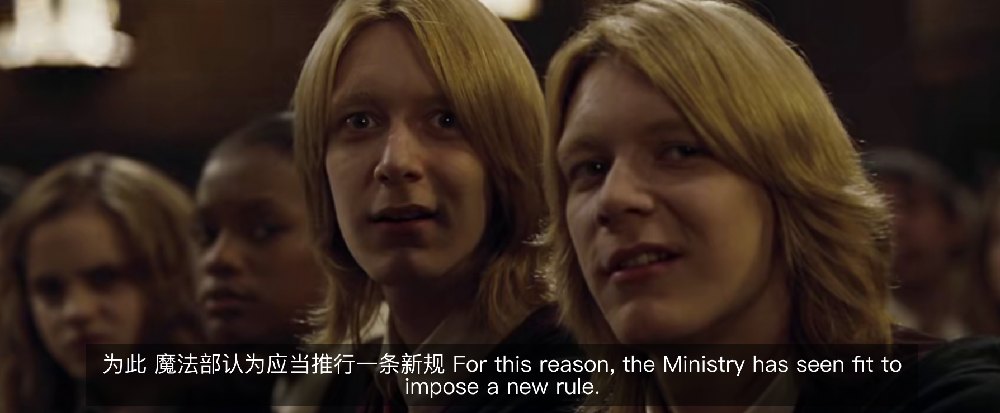
>
> For this reason, the Ministry has seen fit to impose a new rule.
>
> 《哈利波特与火焰杯》
>
> see/think fit to do 认为应该做某事，决定做某事

班主任 impose silence on the class “强制让班里静下来”；现在很多年轻夫妇都不想生孩子，原因就在于生活成本高，孩子会 impose a heavy burden on their lives（2012年考研英语二中出现过）；最近疫情再次抬头，很多人都要强制隔离：impose quarantine for sb.

#### sanction

break sanctions 违反制裁

lift sanctions on/against 解除制裁

#### crushing

crush 压碎、粉碎 -> crushing 毁灭性的、灾难性的

比如乌克兰部队遭遇惨败，就可以说 suffer a crushing defeat；疫情封锁导致商场遭遇沉重打击，可以说 The restriction rules were a crushing blow to malls；再比如前段时间股市暴跌，很多人亏得裤衩都不剩了：be in crushing debt 债台高筑；形容工作压力大、任务繁重，可以用 crushing workload 表示

> 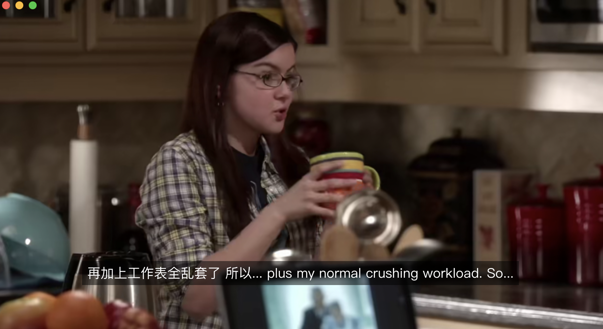
>
> - Honey, you don't drink coffee.
> - I do when I've been up half the night, worrying about a project that's only one-third done, and I still have an apron to sew, scenery to paint, plus my normal crushing workload.
>
> 《摩登家庭》

#### mark

是...的迹象、成为...的征兆、标志着

> 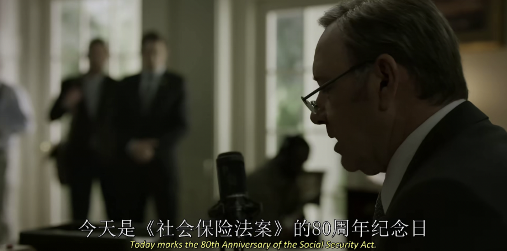
>
> Today marks the 80th Anniversary of the Social Security Act.
>
> 《纸牌屋》

→ Today / This year marks the XX anniversary of... 今天/今年标志着...的XX周年 → 今天/今年是...的XX周年

#### warfare

战争

- information warfare 信息战
- public opinion warfare 舆论战
- psychological warfare 心理战

#### splinter

divide

> 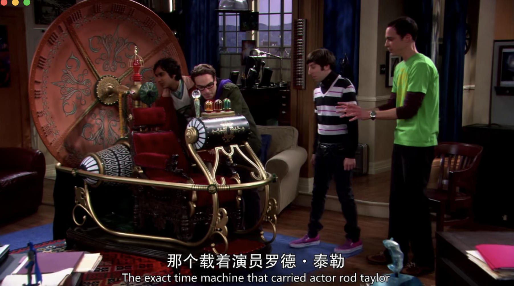
>
> 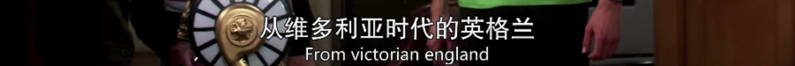
>
> 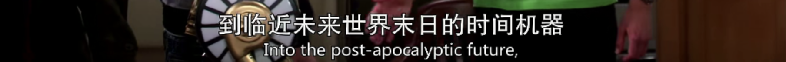
>
> 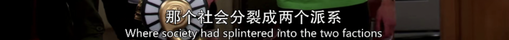
>
> ...where society had splintered into the two factions.
>
> 《生活大爆炸》

#### potent

strong/powerful

> But the other half of the name presents another ingredient, less infamous, perhaps, but also strangely potent: the kola nut.
>
> 《2017年12月英语六级》

也可以形容药效强大

> 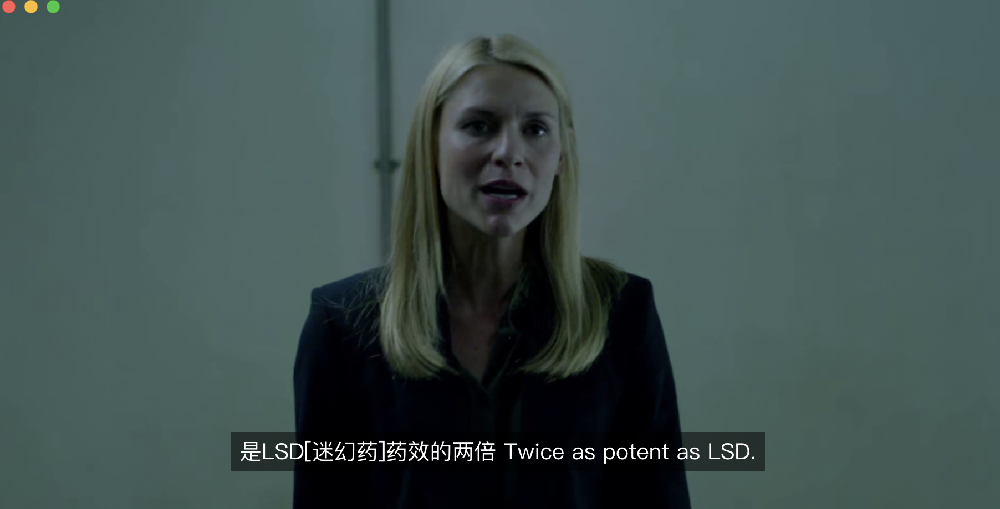
>
> 《国土安全》

#### trigger

引发、激发

>记忆
>
>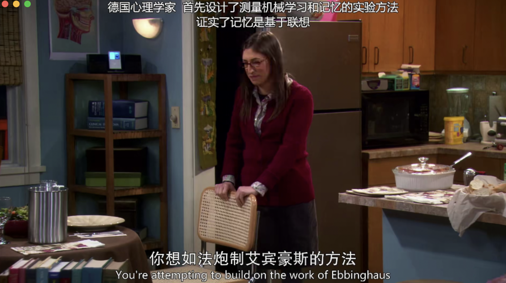
>
>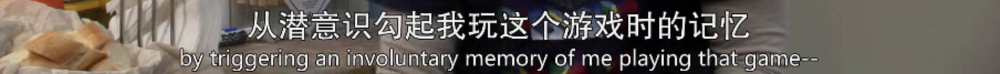
>
>You're attempting to build on the work of Ebbinghaus by triggering an involuntary memory of me playing that game.
>
>《生活大爆炸》
>
>trigger memories of... 唤起……的记忆

> 情绪
>
> Why does social media trigger feelings of loneliness and inadequacy?
>
> Good weather triggers consumers' desire to go shopping.
>
> 《2020年12月英语六级考试》

> 症状
>
> 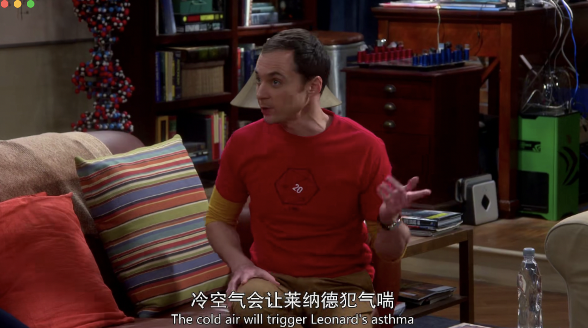
>
> The cold air will trigger Leonard's asthma（哮喘）.
>
> 《生活大爆炸》

> 功能、设备
>
> 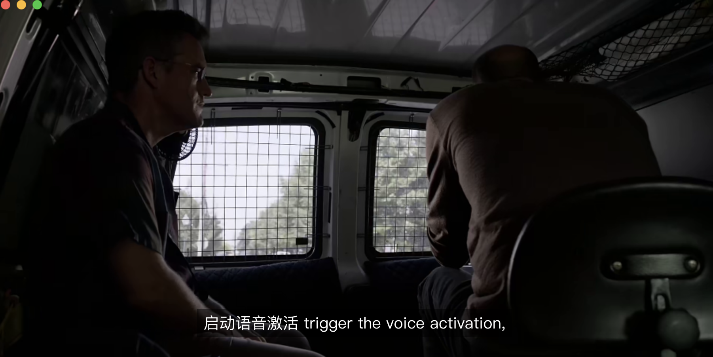
>
> 《国土安全》

> 灾难、问题
>
> This could trigger a tsunami that would create havoc along the coast.
>
> 《2019年12月英语六级》

#### prompt

1. 促使（“导致”是从无到有，“促使”是从有到严重）
2. 导致、激起 = trigger

> But I knew it was not kindness that prompted the offer.
>
> 《月亮与六便士》

> One female comedian, Yang Li, has prompted several nationwide debates.
>
> 2022年《经济学人》年刊

#### unprecedented

un+precedent+ed 史无前例的、空前的

>She was appalled by West Egg, this unprecedented "place" that Broadway（百老汇） had begotten upon a Long Island fishing village.（beget：成为...之父、创造）
>
>《了不起的盖茨比》

#### cause alarm

敲响警钟

可以用 sound the alarm, be a warning, be a wake-up call 替换

#### priority

首要任务、优先事项，在《政府工作报告》中很常见

> Ensuring that our people have enough food **remains a top priority** for our government.（解决好吃饭问题始终**是头等大事**。）
>
> 2021年工作报告

> In our work this year, we must **make** **economic stability** **our** **top priority** and pursue progress while ensuring stability.（今年工作要坚持**稳字当头**、稳中求进。）
>
> 2022年工作报告

XX remains a top priority 某事是头等大事

make...a top priority 使...成为当务之急、优先考虑某事

#### doctrine

a set of beliefs that form an important part of a religion or system of ideas 信条、主义、学说

> The new **doctrine** of equality smashed the bond of subservience between apprentice and master.（“平等主义”的新**思潮**打破了具有从属意味的师徒关系。）
>
> 《鱼翅与花椒》

> 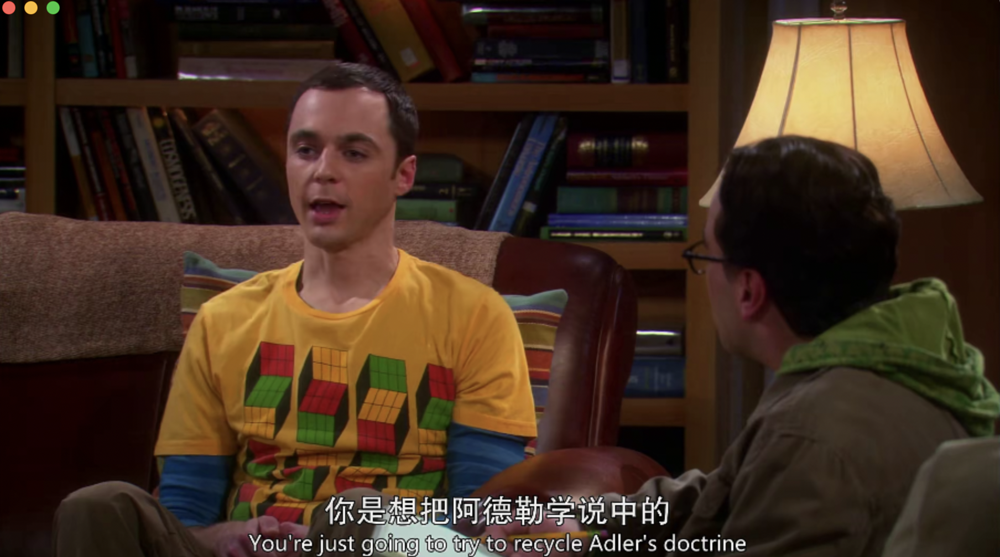
>
> 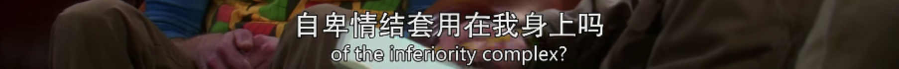
>
> You're just going to try to recycle Adler's **doctrine** of the inferiority complex?
>
> recycle 回收利用（垃圾）、再次使用（观念）
>
> complex 熟词僻义“情节”，比如 Oedipus complex 俄狄浦斯情节（恋母情节）
>
> 《生活大爆炸》

#### autarky autarchy

economic independence 经济上的“自给自足”

清政府的“闭关锁国”政策也可以用 autarchy 表示

#### take ... seriously

重视、严肃对待

> 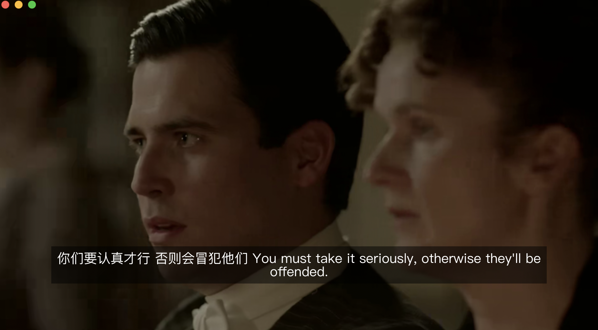
>
> You must take it seriously, otherwise they'll be offended.
>
> 唐顿庄园

take sth for granted 把……看成理所当然

>You should not take others' help for granted.

> 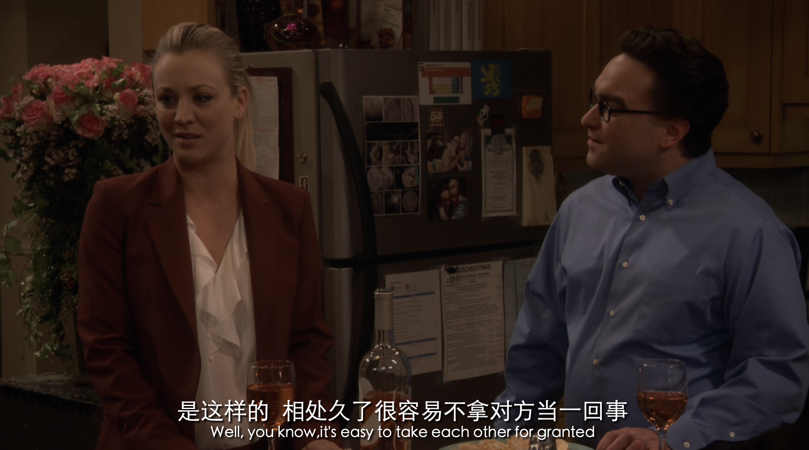
>
> it's easy to take each other for granted.
>
> 生活大爆炸

#### plentiful

大量的

> State dosh, combined with access to **plentiful** public data, has helped turn Chinese AI firms into powerhouses in certain niches.（政府资金，再加上**大量的**公共数据权限，能够帮助中国人工智能公司在某些细分领域成为强大的企业。）
>
> 《经济学人》2022年1月22日

> Migrants to cities are attracted by **plentiful** jobs, access to hospitals and education, and the ability to escape the boredom of a farmer's agricultural life.
>
> 2015年6月英语六级考试

#### instead

表示肯定

instead of 表示否定，意同 rather than

#### be subject to

1. 受……支配，加规则之类的词（rule, law, penalty, sanction）
2. 易受……影响，加不好的事情

> In a society fraught by political danger, where individuals **were subject to** the arbitrary rule of their imperial masters, and careers and reputations could be broken on a whim, it was a safe pleasure, one in which you could lose yourself without fear. The poet Su Dongpo started growing his own vegetables and experimenting in the kitchen only after the collapse of his official career and the start of an impoverished exile.（在一个政治动荡的社会，个人的命运**受制于**专制的帝国君主；事业、名声可能因为某人的心血来潮就毁于一旦。在这样的环境中，食物是很安全的享受，你可以毫无恐惧地在其中放松自己。诗人苏东坡就是在仕途失意、数次贬谪之后，才开始亲自躬耕陇亩、洗手烹鲜。）
>
> 鱼翅与花椒

>As such, they are subject to restrictions on exports to China put in place by Donald Trump and extended by his successor as president, Joe Biden.（正因如此，特朗普将它们列入了对华出口管制清单，其继任者拜登又延续了这一举措。）
>
>《经济学人》2022年1月22日

> Constant government policy changes and police brutality adds to the sufferings of the migrants who have already **been subject to** extended custody, cruel torture, forced labor and many other inhumane treatments.（政府朝令夕改、暴力执法，移民群体**遭受**超期羁押、酷刑和强迫劳动等不人道待遇。）
>
> 《2021年美国侵犯人权报告》国务院新闻办公室

> 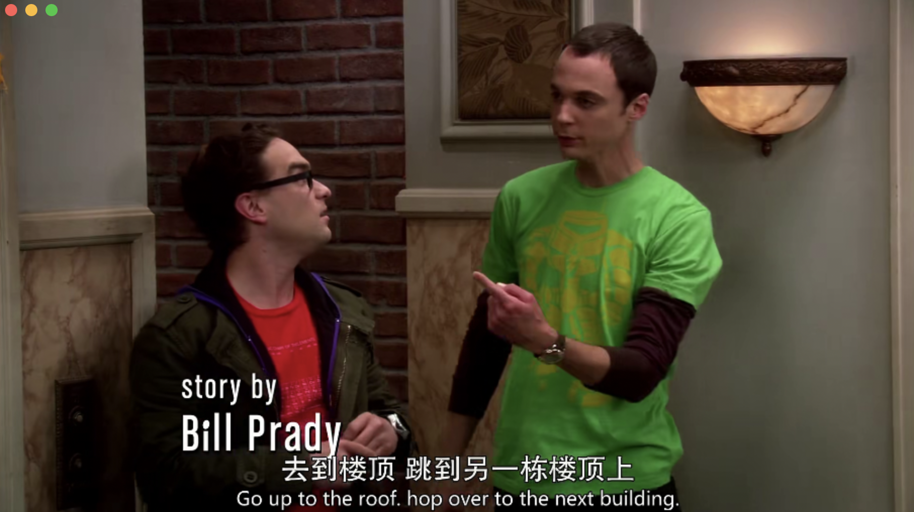
>
> 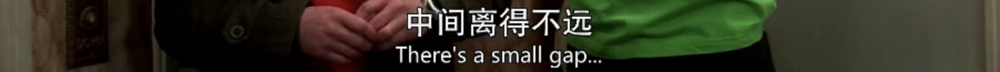
>
> 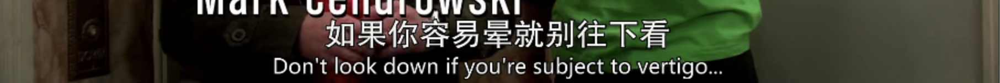
>
> Go up to the roof, hop over to the next building. There is a small gap. Don't look down if you**'re subject to vertigo**.
>
> vertigo 眩晕、头晕目眩
>
> 生活大爆炸

#### torture

n./v. （肉体上的拷打），（精神上的）折磨

> 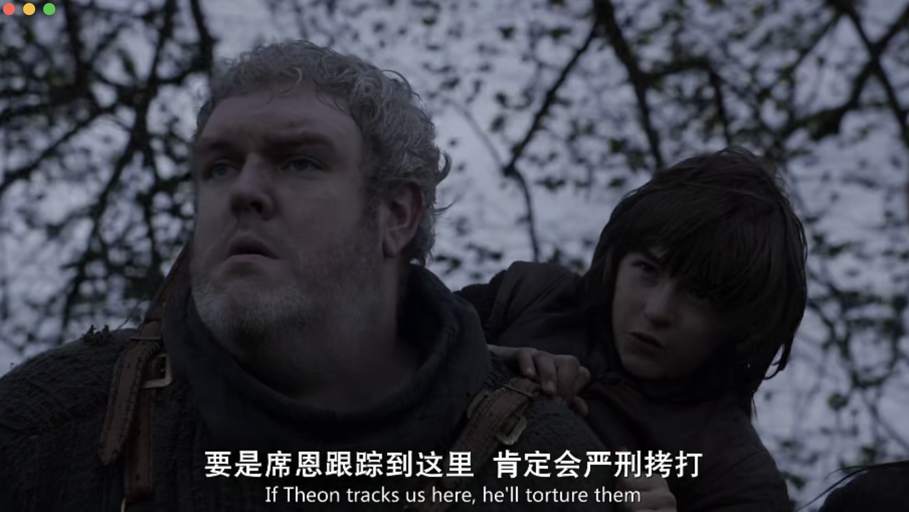
>
> If Theon tracks us here, he'll torture them.
>
> 权力的游戏

> 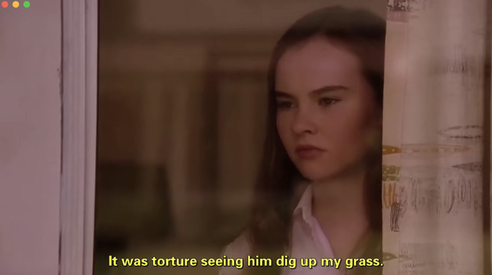
>
> It was torture seeing him dig up my grass.
>
> It is torture doing 做某事很难受
>
> 怦然心动

#### evade

躲避，可以理解成 avoid

> 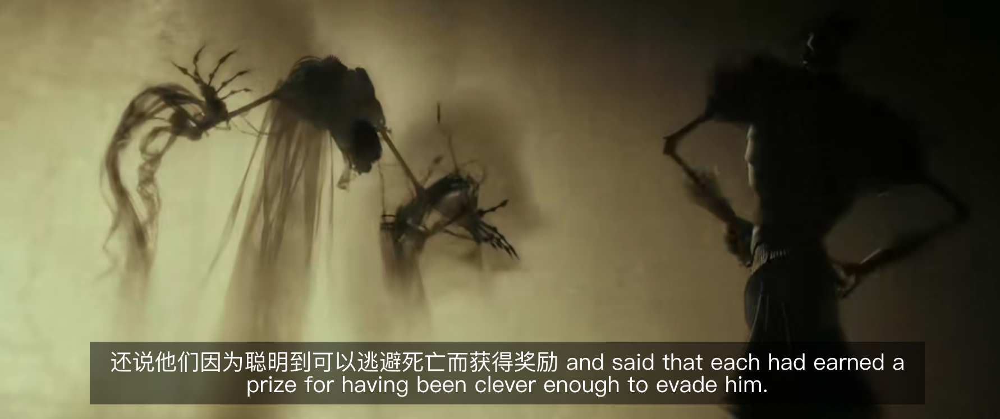
>
> Each had earned a prize for having been clever enough to evade him.（如果有人足够聪明能够躲避他（死神），就可以获得一个奖励。）
>
> 哈利波特与死亡圣器

#### crippling

cripple n. 瘸子 v. 使……成为瘸子→严重危害

crippling 有严重危害的 having a very serious, harmful effect.

>
>
>When Carolyn left me, the loneliness was crippling.
>
>绝望的主妇

#### topple

推翻，常出现在政治语境中

> 
>
> Her testimony is an effort to topple this administration.
>
> 国土安全

topple down 跌倒，摔下去

> Once he nearly toppled down a flight of stairs.
>
> flight 除了“航班”，还可以表示“一段楼梯”。
>
> 了不起的盖茨比

#### apply pressure

apply/put/place pressure on sb. 给……施加压力

escape/get away with/evade 躲避压力（躺平）
