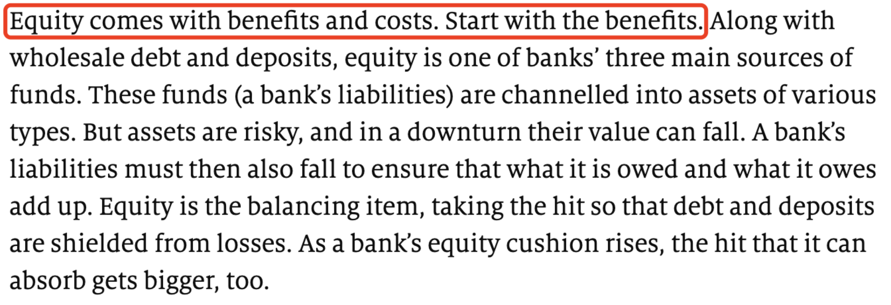
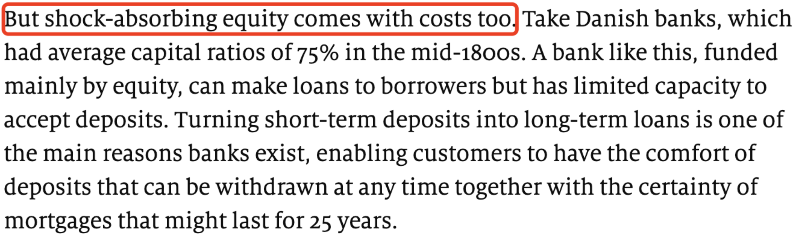
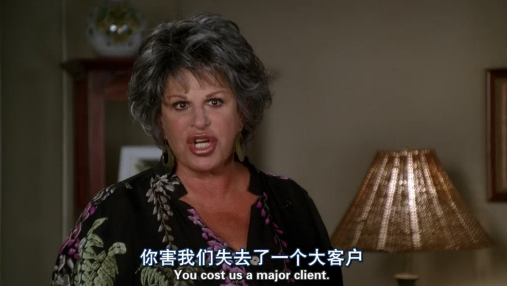

# soren外刊精读

[TOC]

## 作文

### 结构相关

#### 作文如何开篇？如何引出话题？

先交代整体情况，通过 XX is no exception 来引出要描述的主题。

> In much of the world the business of running ski slopes has, like most of tourism, been crippled by lockdowns and travel restrictions. China is no exception.

> 寒假小课U4

#### In a society fraught by/with 在一个……样的社会中

> In a society fraught by political danger, where individuals were subject to the arbitrary rule of their imperial masters, and careers and reputations could be broken on a whim, it was a safe pleasure, one in which you could lose yourself without fear.（在一个政治动荡的社会，个人的命运受制于专制的帝国君主；事业、名声可能因为某人的心血来潮就毁于一旦。在这样的环境中，事物是很安全的享受，你可以毫无恐惧地在其中放松自己。）

这句话中有一个很好的表达：In a society fraught by political danger，可以延伸出：In a society fraught by/with challenges/risks/ ...表示“在一个充满……的社会中。

比如，在”职业“”就业“等话题的写作中，可以用 In a society fraught by risks of losing jobs 引出主题。

>精读·写作18期U1

#### 如何介绍正反双方的观点？

Are sth. really adj. ? sb. are split.

The case for the defence is that... . Defenders argue... .

The prosecution retorts that... .

1. 先通过设问引出议题，指出争议
2. 用词 be split 比 different people have different opinions 更”高大上“。
3. 通过”The case for the defence is that...“ ”defenders argue... ”引出辩护方（支持者）的观点
4. 通过“The prosecution retorts that...”引出指控方（反对者）的观点，其中 prosecution 和前面的 defenders 相对应；retort 比 think/believe 态度更加鲜明，更能体现出双方针锋相对的局面。

> 寒假小课U1

#### 如何表达递进逻辑关系

> The reluctance to go home **was not confined to** wayward men.
>
> 不只是任性的男客不想回家

> His kindness **was not confined to words**; for within an hour after he left them, a large basket full of garden stuff and fruit arrived from the park, which was followed before the end of the day by a present of game.
>
> 他的一片好心不光挂在嘴皮上，他走后不到半个钟头，就打发人从巴顿庄园送来一大篮子蔬菜水果，天黑之前又送来些野味。
>
> 理智与情感

表达递进的逻辑关系时，我们第一反应是 not only...but also...，比如第二句我们可能会说：

His kindness was reflected not only in words, but also in actions. Within an hour after he left them, a large basket full of garden...

而原文用了 be not confined to（不限于）表达递进的逻辑关系，不落窠臼。

> 精读·写作18期U2

#### 如何进行比较？

> Some people hope that the internet will revolutionize higher education, making it cheaper and more accessible to the masses. Others fear the prospect. Some academics worry that they will be sacked and replaced by videos of their more photogenic colleagues. Others argue that MOOCs(massive open online courses) **are nowhere near as good as** a class taught face-to-face.
>
> 一些人认为互联网能改革高等教育，使其更便宜、更普及。其他人则对前景感到担忧。一些学者担心他们会被解雇，取而代之的是他们更上镜的同事的视频。另一些人则认为慕课(大规模在线开放课程)远不如面对面授课好。

可以从这段话中提炼出一个写作句型：A be nowhere near as XX as B，意思是“A远没有B那么XX”，用于进行比较。

这个句型的简化版是 not as XX as，nowhere near 是 not at all 的意思，可以翻译成“远没有、远不及”。

>精读·写作18期U2

#### 如何分析问题？

Start with XX problems ...

A second concern is ...

A third worry is ...

1. 摆脱了 first, second, third 这种俗套用法，取而代之的是 start with, a second, a third 这种更新颖的说法。
2. 用不同的词 problem, concern, worry 表达同一个含义。在写作中，这三个词以及 risk 都是可以相互替换的。

> 寒假小课U3

#### 如何进行利弊分析

>
>
>
>
>**Equity comes with benefits and costs. Start with the benefits.** Along with  wholesale debt and deposits, equity is one of banks' three main sources of funds. These funds (a bank's liabilities) are channeled into assets of various types. But assets are risky, and in a downturn their value can fall. A bank's liability must then also fall to ensure that what it is owed and what is owes add up. Equity is the balancing item, taking the hit so that debt and deposits are shielded from losses. As a bank's equity cushion rises, the hit that it can absorb gets bigger, too.
>
>**But shock-absorbing equity comes with costs too.** take Danish banks, which had average capital ratios of 75% in the mid-1800s. A bank like this, funded mainly by equity, can make loans to borrowers but has limited capacity to accept deposits. Turning short-term deposits into long-term loans is one of the main reasons banks exist, enabling customers to have the comfort of deposits that can be withdrawn at any time together with the certainty of mortgages that might last for 26 years.
>
>经济学人

可以从中提炼出一个写作模板：

XX comes with benefits and costs. Start with the benefits...

But XX comes with costs too...

XX带来了好处也带来了代价，首先谈一谈好处...

但XX也带来了代价。

可以套用这个模板来分析事物的利与弊。

come with 可以和 go with, accompany 或 be accompanied by...替换

accompany 除了“陪伴”，也可以引申为“带有、同时存在/发生”的意思

> As with all new technologies, pitfalls **accompany** the promise.
>
> 和所有的新技术一样，问题伴随着希望。
>
> 经济学人

> Every tremor of progress in history has **been accompanied by** a moral panic.
>
> 历史上，每次科技进步带来改变的同时，也会引起一场道德恐慌。

我们表示“与此同时、随着”的概念时，一般会想到 at the same time, meanwhile 等，而如果能用 come with / go with / accompany 替换，则会让句子更加灵活、地道。

> 精读·写作18期U2

#### 如何引出方案

It would be wise to ... . A good place to start would be with ... . ……很明智。首先一点是……

1. 写作中课用来提出方法建议。
2. 先通过 It would be wise to 引出行动。
3. 再通过 A good place to start would be with 引出具体的建议。

> It would be wise to get ahead of the discussion. A good place to start would be with hard data.

> 寒假小课U2 U3

#### 如何提出方案

> Ensuring that our people have enough good food remains a top priority for our government.（解决好吃饭问题始终是头等大事）
>
> 政府工作报告 2021

> In our work this year, we must make economic stability our top priority and pursue progress while ensuring stability.（今年工作要坚持稳字当头、稳中求进。）
>
> 政府工作报告 2022

> The West's priority must be to win the economic confrontation with Russia.

可以从这几句话中提炼出来一套新的表达：

- XX remains a top priority.
- We make XX our top priority.
- Our top priority must be XX.

替换提出建议时的 way, method, means, solution 等常规表达。

>精读·写作18期U1

#### 如何提出方案、建议？

> **Tweaks have been made to** preserve the principle of one bool, one price.
>
> 经济学人

可以从这句话中提炼出一个写作句型：Tweaks have been / should be  made to ... 可用于提出方案建议。

这个句型是被动语态，突出方案建议，弱化人的主体位置，相比于我们经常使用的 First, we should...; The first method to solve the problem is...，这个句型更加地道。

>精读·写作18期U2

#### 如何引出结果

only to find... 结果却发现，表示一种意外结果，相当于 but the result is...

> 寒假小课U2

#### 如何分析结果

> As such, they are subject to restrictions on exports to China put in place by Donald Trump and extended by his successor as president, Joe Biden.（正因如此，特朗普将它们列入了对华出口管制清单，其继任者拜登又延续了这一举措。）

句首的 as such 是一个很地道的表达，表示“照此、正因如此”，可用于分析结果。

>精读·写作18期U1

#### 如何进行评价

XX is(view as) more of ... , rather than ... 更多是……，而不是……，可以对某种行为、现象进行评价。

>寒假小课U3

### 结构无关

#### ...的关键不在于XX，而在于YY

The key to ... is not ... but ... 做……的关键不是……而是……

> 寒假小课U2 U3

#### 如何进行类比

Unlike XX+定语从句, YY(主句). 不像 XX 如何如何，YY 怎样。

1. 定语从句部分可用来补充 XX 的信息。
2. YY 部分是主要内容。

> 寒假小课U2

#### 如何表达“激烈讨论”的含义？

Nowhere does debate rage more fiercely about XX than in YY. 关于 XX，YY 的讨论最为激烈，XX 为讨论的内容，YY 为讨论的地点。

1. 否定词位于句首，句子用部分倒装。
2. 通过“否定词+比较级”的形式，表达“最高级”的含义。
3. rage 用得非常地道。

> 寒假小课U3

#### 如何表达态度、感受？

Many feel XX at the prospect of ... 一想到……，很多人就会 XX 。写作中可以用来表达人们的态度、感受。

> 寒假小课U3

#### an avalanche of 的用法

##### 表示引发争议/愤怒

provoke an avalanche of controversies/ire 表示引发大量争议/愤怒

##### 受到关注

receive/be greeted with an avalanche of attention/publicity 表示引发大量关注

>寒假小课U4

#### 受到冲击

be crippled by 表示受到冲击

> In much of the world the business of running ski slopes has, like most of tourism, been crippled by lockdowns and travel restriction.

> 寒假小课U4

#### 如何形容“天壤之别”

be a world away (from) 表达 different 的概念

> 寒假小课U4

#### 如何对某一现象发表评价？

> The fact that Russia did not take the threat of sanctions seriously at first is no surprise. For years they have been plentiful but ineffective.

The fact that XX is no surprise. For years ...

……一事并不令人惊讶。多年来……

1. the fact 后接 that 引导的同位语从句，对 the fact 的内容进行补充，介绍现象
2. is no surprise = is not a surprise，是对 the fact 的评价。写作中也可以根据实际需要，灵活替换 surprise，比如 worry。
3. For years 解释 no surprise/worry 的原因

> 精读·写作18期U1

#### 如何表示下定决心

> On February 26th that Rubicon was crossed, when sanctions were imposed on the world's 11th-biggest economy.

cross the Rubicon，表示“破釜沉舟，背水一战”。写作中如果能灵活使用这一短语，可以增加文章的文化底蕴。

>cross the Rubicon

> 精读·写作18期U1

#### 如何体现因果关系？

> State dosh, combined with access to plentiful public data, has helped turn Chinese AI firms into powerhouses in certain niches.（政府资金，再加上大量的公共数据权限，能够帮助中国人工智能公司在某些细分领域成为强大的企业。）

可以提炼出一个很实用的句型：A, combined with B, can help C，意思是“A和B有利于C”“A加上B有利于C”。

这句话提供了一个新的思路：通过 combined with 表达“和”“以及”的含义，更加新颖。

可以把“can help C”根据实际需要进行修改，比如“can lead to C”。

>精读·写作18期U1

#### 如何表达“人们普遍认为一种情况，而事实是另外一种情况”的概念？

> The town offers better cultural advantages than has been generally supposed.（这座城镇的文化优势比人们通常认为的更大。）

在表达“人们普遍认为一种情况，而事实是另一种情况”时，可以用 than has been generally supposed 替换 People generally believe that ..., but actually ...，使语言更加地道。

>精读·写作18期U1

#### 比较两个事物的特点

> Some people hope that the internet will revolutionise higher education, making it cheaper and more accessible to the masses. Others fear the prospect. Some academics worry that they will be sacked and replaced by videos of their more photogenic colleagues. Others argue that MOOCs (massive open online courses) are nowhere near as good as a class taught face-to-face.
>
> 一些人认为互联网能改革高等教育，使其更便宜、更普及。其他人则对前景感到担忧。一些学者担心他们会被解雇，取而代之的是他们更上镜的同事的视频。另一些人则认为慕课(大规模在线开放课程)远不如面对面授课好。

A is nowhere near as...as B 是一个写作句型，可用于比较两个事物的特点，意思是“A远没有B那么……”。

> 精读·写作18期U2

### 表达替换

#### 太，加深程度

> We were kept waiting longer **than was absolutely necessary**.（他让我们等了太久了！）
>
> 以后表达“太”的含义，或加深程度时，除了 very，就可以用 than is necessary 表示
>
> > He spent more money **than was necessary**.

> 精读·写作18期U1

#### very much

> The city centre has altered beyond recognition (changed very much).
>
> 市中心变得都认不出来了。

>精读·写作18期U2

#### 大受欢迎

grain traction 是个很地道的搭配，是 become popular 的高级替换

> The fact that numerous fast fashion brands left China is no surprise. For years, local brands have gained traction thanks to the low cost, the rise of online platform and the fresh design more palatable to the local market.
>
> 多家快时尚品牌离开中国并不令人意外。多年来，由于成本较低、在线平台的崛起以及更符合当地市场的新鲜设计，本土品牌大受欢迎。

>精读·写作18期U1

#### 表示假设

> Although China can inflict huge economic costs on the West by blocking supply chains, it is now clear that in the event of a war over Taiwan, the West could freeze China's $3.3trn reserve pile.

原句使用 in the event of 表示“如果……发生”，可以替换常用的 if，表达“假设”的概念。

>精读·写作18期U1

## 经典例句

But the critics of cash have **been met by** their own critics, who argue that electronic payments can disenfranchise poor people who lack easy access to bank accounts and the internet and can make it much easier for governments and corporations to monitor a person’s every step.

而现金支付的批评者也**遭到了**批评，这些批评指出，电子支付会剥夺穷人的权利，因为他们难以办理银行账户，也很难接触到互联网。而且，有了电子支付，政府和企业能更方便地监督人们的每个动作。 

> 精读·写作18期 精读4 第5句注解

My parents arrived as the leaves began to turn, when campus was at its most beautiful, the reds and yellows of autumn **mingling with** the burgundy (深红色) of colonial brick.

树叶开始变色时，我的父母来到了校园。那正值校园最美丽的时候，秋日红色和黄色的树叶与殖民时期建筑风格的酒红色砖墙**交相辉映**。

> 精读·写作18期 U3 精读2 第4句注解

## 语法要点

### 介词+which/whom 的定语从句

#### 介词配合动词

主干：主语+谓语+介词+whom/which+

从句：主语+谓语

介词与从句动词形成动词词组（eg. wait for, depend upon/on, deal with, look up to, etc）

> I won’t tell the secret to a person in whom I don’t believe.
>
> believe in

> His failure was a heavy blow from which he never fully recovered.
>
> recover from

> There is a great demand for high-quality tuna, on which people in Japan would spend much money.
>
> spend on

> Without chips it(Huawei) cannot make the smartphones or mobile-network gear on which its business depends.
>
> depend on
>
> 经济学人 2020年9月12日

#### 介词配合名词

主干：主语+谓语+名词+介词+whom/which

从句：主语+谓语

介词与名词形成名词词组

> She showed me her engagement ring, on which there were three small diamonds.
>
> on the ring → on which

> I arrived home at six o’clock, at which it began to rain heavily.
>
> at six o’clock → at which

> I am looking for a box in which I can put some rare stamps.
>
> in the box → in which

> The speed at which covid-19 vaccines have been produced has made scientists household name.
>
> at the speed → at which
>
> 经济学人

> And, besides experience, the games industry has plenty of ready-made early adopters for whom virtual worlds are already an established cultural norm.
>
> 经济学人 2021年11月20日

#### 补充句型

句型：part/some/many/both/none .. of which/whom ...

which 代替前面主要子句中所提过的事物

whom 代替前面主要子句中所提过的人

The club consists of thirty members. Most of them are teachers.   
→ The club consists of thirty members, most of whom are teachers.

Mr Floyd's death in Minneapolis on 25 May sparked protests throughout the country and the world, the vast majority of which have been peaceful.  
→ Mr Floyd's death in Minneapolis on 25 May sparked protests throughout the country and the world, and the vast majority of them have been peaceful.

Tina bought many books. Some of them are romantic novels.   
→ Tina bought many books, some of which are romantic novels.

It is one of the Wu languages of eastern China, many of which are mutually comprehensible, with 80m speakers altogether.  
→ It is one of the Wu languages of eastern China, and many of the Wu languages are mutually comprehensible, with 80m speakers altogether.

> In a society fraught by political danger, where individuals were subject to the arbitrary rule of their imperial masters, and careers and reputations could be broken on a whim, it was a safe pleasure, one in which you could lose yourself without fear. The poet Su Dongpo started growing his own vegetables and experimenting in the kitchen only after the collapse of his official career and the start of an impoverished exile.
>
> 鱼翅与花椒

> 精读·写作18期U1

### the+形容词比较级，the+形容词比较级

表示越……，越……

> **The harder** we work, **the less** time we have / to enjoy the luxuries / our labour affords us. **The more** lavish / the luxuries we seek, **the more** we must earn / to acquire them, and **the longer and harder** we find ourselves working.（我们越努力工作，用来享受工作所带来的奢侈品的时间就越少。如果我们想买更昂贵的奢侈品，就要赚更多的钱，会发现自己要更长时间、更努力地工作。）
>
> 1843（经济学人 姊妹刊）

这个句型非常灵活，有很多变体

#### 谓语倒装

如果后半部分主语过长，可以把谓语动词放到前面，用倒装

> The younger the child is, the more is the child's need of sleep.

#### 谓语 be 动词可省略

如果谓语动词是 be 动词，可以省略，可以不省略，可以省略任何一个

> The stronger the magnet, the greater the number of lines of magnetic force.

#### 句子+the more

变成“句子+the more”的结构

> I play (the) better, the more I practice.

#### 练习

翻译：25-30岁的未婚女人为“圣斗士”，30岁以上为“斗战胜佛”，35岁以上为“齐天大圣”。

讲解：这句话看似很难，“圣斗士”“斗战胜佛”“齐天大圣”，乱七八糟的……其实，翻好一句话，我们不能逐词转化（因为英语和汉语的思维逻辑不同，逐词翻译老外看不懂），而要理解这句话的“内在含义”，然后把“内在含义”表达出来。这句话“圣斗士”“斗战胜佛”“齐天大圣”，看上去很复杂，其实表达的都是一个意思：未婚女性的年龄越大，越不被社会所接纳，所以我们把这层意思表达出来就可以

> The older an unmarried woman is, the more she is unaccepted by society.
>
> The older an unmarried woman is, the more she is despised.
>
> The older an unmarried woman is, the more she is looked down on.

>The older an unmarried woman is, the more she is demonized.
>
>demonize 源自 demon（妖魔），意思是“将……妖魔化”

> 精读·写作18期U1

### than 后面可以跟哪些结构

#### 1. than 后面直接加动词

> Kim Byong-yeon at Seoul National University says the figures are a reminder that the North’s economy is more vulnerable to external shocks **than might be expected** for such a reclusive country.
>
> 经济学人 2018年7月28日

> We were kept waiting longer **than was absolutely necessary**.（他让我们等了太久了！）
>
> 以后表达“太”的含义，或加深程度时，除了very，就可以用 than is necessary 表示
>
> > He spent more money **than was necessary**.

>The town offers better cultural advantages **than has been generally supposed**.

> In their recent work, however, some researchers have come up with the finding that influentials have far less impact on social epidemics **than is generally supposed**.
>
> 2012年 考研阅读理解 Text4

> The outgoing prime minister has done a far better job **than is commonly acknowledged**.
>
> 经济学人

#### 2. than 后面还可以接句子

> The game was closer **than the score suggests**.
>
> 实际比赛比分数显示的更难分高下。

> Girls in most rich countries consistently report being slightly sadder **than boys do**, particularly from puberty onwards.
>
> puberty 青春期
>
> from ... onwards 从……时候开始
>
> 经济学人 2020年 圣诞双刊

> He leaves a much more impressive legacy **than his muted exit suggests**.
>
> 经济学人

> Average working hours in the 18th century were shorter **than they became** in the 19th.
>
> 经济学人 2020年 圣诞双刊

#### 3. than 后面还可以接 when, if 等引导的从句

> You are a little fatter **than when I saw you last**.

>They work better together **than if they are alone**. 

> 精读·写作18期U1

## 地道表达

### be met by/with

泛指“遭遇、遇到”

后面可以加 applause，enemy，critics，support/approval，opposition/disapproval，success，failure

可使行文更加地道

We have finally achieved success after hard work.  
→Our hard work has finally been met with success.

We have won some support with our ideas.  
→Our ideas have been met with some support.

> 
>
> Usually, he's met by cheers.
>
> 生活大爆炸

> But the critics of cash have **been met by** their own critics, who argue that electronic payments can disenfranchise poor people who lack easy access to bank accounts and the internet and can make it much easier for governments and corporations to monitor a person’s every step.（而现金支付的批评者也**遭到了**批评，这些批评指出，电子支付会剥夺穷人的权利，因为他们难以办理银行账户，也很难接触到互联网。而且，有了电子支付，政府和企业能更方便地监督人们的每个动作。 ）
>
> 经济学人

>精读·写作18期U1

### be vulnerable to

easy to be affected by sth bad

容易受到不好事物影响的

是一个很常见、很地道的表达

to 是介词

> When payments dematerialize, people and shops **are less vulnerable to** theft.（当实现无纸支付的时候，买家和卖家的资金会更加安全。）
>
> 经济学人

> The present **seemed vulnerable to** the past, as if I might blink, and when my eyes opened I would be fifteen.（过去的影响挥之不去，仿佛一眨眼，睁开眼睛时，我又会回到十五岁。）
>
> 你当像鸟飞往你的山

>精读·写作18期U1

### have no choice but to do 

表示“别无选择，只能……”

> When Russia’s demands for security guarantees from NATO were neglected time and again, Putin had no choice but to crossed the Rubicon.
>
> 俄罗斯需要得到北约的安全保障，但这一需求一再被忽视，普京别无选择，只能破釜沉舟。

### cost sb sth

是一个很地道的表达，意思是“使某人付出了某个代价、使某人失去了某物”

>It cost me an arm and a leg.
>
>它让我花了一笔巨款。
>
>an arm and a leg 是俗语，表示 a lot of money

> Year-long lockdowns would cost America and the euro zone a third or so of GDP.
>
> 2020年4月 经济学人

> 
>
> You cost us a major client.
>
> 你害我们失去了一个大客户。
>
> 绝望的主妇
