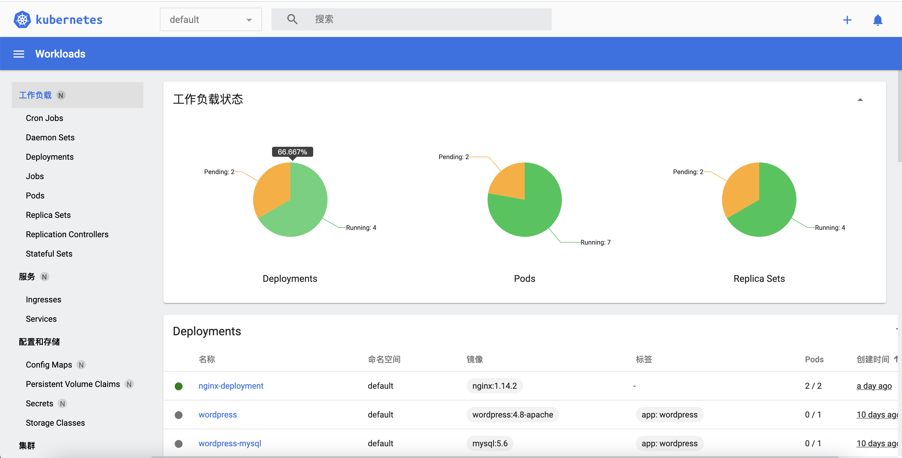
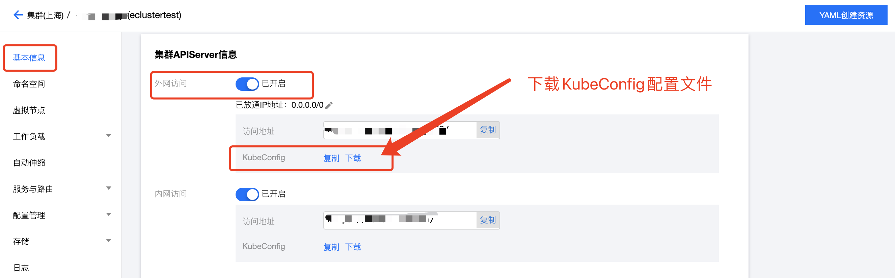
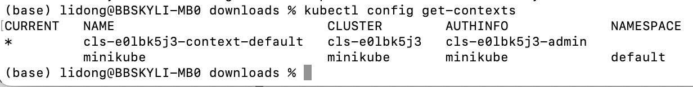
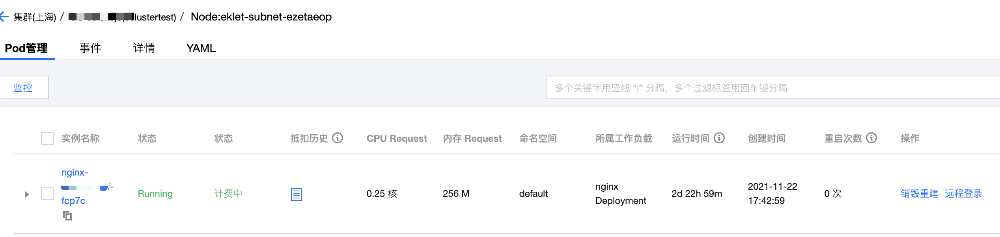
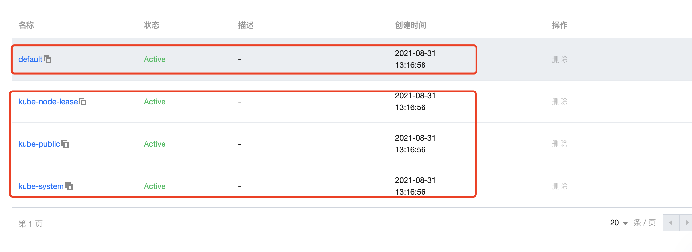
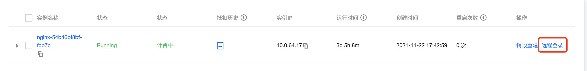

# 第5章 Kubernetes快速入门

Kubernetes是一个应用编排器，主要用于部署、管理和拓展容器化的云原生微服务应用。它可以在无需人工干预的情况下进行应用程序的部署、根据业务需要自动扩缩容、当出现故障时自愈、进行不停机的滚动升级和回滚等等。

>要学习Kubernetes，推荐在本地安装minikube和在云端使用云端托管的Kubernetes集群（比如TKE、EKS等）。而管理Kubernetes则可以使用kubectl命令行工具和Dashboard可视化平台。

## 安装必备的工具

### 安装包管理器与cURL

电脑上有很多开发上的小软件，比如wget、curl、git等，更建议使用包管理器来下载，比如Mac常用的Homebrew（推荐）和MacPorts，Windows常用的Winget（官方出品）、Chocolatey（生态暂时更丰富，推荐）、scoop。接下来我们简述一下如何在电脑上安装包管理器。

### 安装kubectl与minikube

kubectl是Kubernetes的命令行工具，让你可以使用命令的方式来管理Kubernetes集群（本地的或托管的），比如部署应用、监测和管理集群资源以及查看日志等。而Minikube可以在本地部署Kubernetes，方便你的学习与开发。

#### 安装kubectl

```shell
cat <<EOF > /etc/yum.repos.d/kubernetes.repo
[kubernetes]
name=Kubernetes
baseurl=https://mirrors.aliyun.com/kubernetes/yum/repos/kubernetes-el7-x86_64/
enabled=1
gpgcheck=1
repo_gpgcheck=1
gpgkey=https://mirrors.aliyun.com/kubernetes/yum/doc/yum-key.gpg https://mirrors.aliyun.com/kubernetes/yum/doc/rpm-package-key.gpg
EOF
```

#### 安装minikube

```shell
curl -LO https://storage.googleapis.com/minikube/releases/latest/minikube-latest.x86_64.rpm
sudo rpm -Uvh minikube-latest.x86_64.rpm
```

#### 卸载minikube

```shell
minikube stop; minikube delete
docker stop (docker ps -aq)
rm -r ~/.kube ~/.minikube
sudo rm /usr/local/bin/localkube /usr/local/bin/minikube
systemctl stop '*kubelet*.mount'
sudo rm -rf /etc/kubernetes/
docker system prune -af --volumes #此条命令会删除所有的镜像，网络，volume卷
```

## 在本地创建Kubernetes集群

确定minikube安装成功后，就可以在终端中输入以下命令在本地启动一个单节点的Kubernetes集群，首次启动需要下载镜像会比较慢

```shell
minikube start
```

如果cpu为单核，则需执行以下命令

```shell
minikube start --driver=none \
               --extra-config=kubeadm.ignore-preflight-errors=NumCPU \
               --force --cpus 1 \
               --image-repository=registry.cn-hangzhou.aliyuncs.com/google_containers
```

如果启动显示`Sorry, Kubernetes 1.22.3 requires conntrack to be installed in root's path`，则需安装`conntrack`

```shell
yum install -y conntrack
```

如果报以下错误

```
stderr:
        [ERROR FileContent--proc-sys-net-bridge-bridge-nf-call-iptables]: /proc/sys/net/bridge/bridge-nf-call-iptables contents are not set to 1
[preflight] If you know what you are doing, you can make a check non-fatal with `--ignore-preflight-errors=...`
To see the stack trace of this error execute with --v=5 or higher
```

则执行以下命令

```shell
echo 1 > /proc/sys/net/bridge/bridge-nf-call-iptables
echo 1 > /proc/sys/net/bridge/bridge-nf-call-ip6tables
```

当本地的Kubernetes集群运行起来之后，执行以下命令将会自动在浏览器中打开Kubernetes控制台

```shell
minikube dashboard
minikube addons enable dashboard # 或者使用这种方式打开
```

本地集群的Dashboard和EKS的控制台其作用和功能基本都是相同的，我们可以通过这个可视化的方式来学习以及来管理Kubernetes。

如果卡在`🤔  正在验证 proxy 运行状况 ...`，则停止进程执行以下指令查看日志

```shell
minikube dashboard --alsologtostderr -v=1
```



> dashboard卡I1224 17:01:34.874279    5269 dashboard.go:127] Success! I will now quietly sit around until kubectl proxy exits!

打开之后，要配置外网访问，所以暂时就先用kubectl proxy代理，绑定公网访问，这样可以在浏览器访问所有的资源了，端口号自己设定就好

```shell
kubectl proxy --address='0.0.0.0' --accept-hosts='^*$' --port=8009 &
```

查看以下网址：

```shell
http://你的ip:8009/api/v1/namespaces/kubernetes-dashboard/services/kubernetes-dashboard/proxy
```

## 通过Kubectl连接Kubernetes集群

### 配置Kubeconfig

传统Linux虚拟机方式，一般都是使用SSH客户端连接到运行了SSH服务的远程服务器上，通过ssh命令来控制。而Kubernetes集群，如TKE、EKS，我们可以使用Kubectl来连接并控制。

>默认情况下，kubectl在`$HOME/.kube`目录下查找名为`config`的文件。我们可以通过设置`KUBECONFIG`环境变量或者设置`--kubeconfig`参数来指定其他 kubeconfig文件。

打开EKS控制台，进入到之前创建的弹性集群实例的管理页面，点击左侧菜单的【基本信息】，然后开启集群的APIServer的外网访问, 建议配置放通单个IP或CIDR（可以通过百度搜索IP来了解你的电脑当前IP地址）。



下载kubeconfig配置文件到本地，并执行以下指令以合并多个集群的config

```shell
KUBECONFIG=~/.kube/config:~/Downloads/cls-****-config kubectl config view --merge --flatten > ~/.kube/config
export KUBECONFIG=~/.kube/config
```

其中，`~/Downloads/cls-****-config`为本集群的kubeconfig的文件路径，请替换为下载至本地后的实际路径。

KUBECONFIG 环境变量包含一个kubeconfig文件列表。对于Linux和Mac，列表以冒号分隔。对于Windows，列表以分号分隔。KUBECONFIG环境变量不是必要的。如果KUBECONFIG环境变量不存在，kubectl会使用默认的kubeconfig文件，`$HOME/.kube/config`。

### 使用kubectl连接EKS

完成kubeconfig 配置后，我们可以通过以下指令来查看config中有哪些环境，执行以下命令后，你就会发现云端EKS的环境了

```shell
kubectl config view         #显示合并后的kubeconfig设置，或者显示指定的kubeconfig配置文件。   
kubectl config get-contexts #查看kubeconfig中的环境
```



其中`*`表示是当前的环境，我们可以通过以下命令来切换到云端的环境，也可以实现本地集群和云端集群的来回切换

```shell
kubectl config use-context cls-****-context-default #切换到云端K8s集群
kubectl config use-context minikube   #切换到本地集群
kubectl config use-context cls-****-context-default #切换回云端集群
```

切换成功后，会显示以下信息，也可以在终端直接输入`kubectl config current-context`来显示当前集群的环境

```shell
Switched to context "cls-****-context-default"
```

再在终端输入以下命令，来了解Kubernetes集群的版本信息，这里有两个版本，client version指的是本地kubectl命令行工具的版本，而server version指的是EKS或minikube kubernetes的版本。

```shell
kubectl version
kubectl cluster-info
```

一般来说，kubectl命令行工具的客户端版本和Kubernetes集群的版本差异不要超过`+/-1`。

然后再在终端输入以下命令测试是否可正常访问集群。如果无法连接请查看是否已经开启公网访问或内网访问入口，并确保访问客户端在指定的网络环境内。

```shell
kubectl get node  
```

通过以下命令，我们可以查看到当前集群内的容器

```shell
kubectl get pods --all-namespaces
```

于Kubectl命令行，可以在终端输入`kubectl --help`来了解更多详细信息，以及查看官方技术文档： **技术文档：**[kubectl命令行](https://kubernetes.io/docs/reference/generated/kubectl/kubectl-commands#config)

## Dashboard与命令行

kubectl命令行非常繁杂（远比Docker CLI要复杂得多），可以在终端输入`kubectl --help`来大致了解有哪些命令；Kubernetes也有非常多的概念，接下来我们结合EKS的控制台与命令行来简单了解一下。

### 关于Node

通常集群中会有若干个节点，Kubernetes通过将容器放入在节点（Node）上运行的Pod中来执行你的工作负载。节点（Node）可以是一个虚拟机或者物理机器，取决于所在的集群配置，每个节点包含运行Pods所需的服务。

>弹性集群没有Node，只有虚拟Node，所以不支持部分依赖一些Node组件，例如 Kubelet、Kube-proxy的功能。EKS也不支持添加、管理物理节点。如果想了解Node的更完整的信息，可以去创建TKE的集群。

打开EKS集群实例的控制管理页面，点击左侧的虚拟节点，就可以看到虚拟节点列表。我们有可以在终端输入以下命令来了解节点Node的信息

```shell
kubectl get nodes                   #获取节点列表
kubectl describe node <node的名称>  #了解节点的所有状态
kubectl top node <node的名称>       #了解节点的内存和CPU使用情况
```

通过`kubectl describe`可以了解一个节点的状态包括地址（如集群内部路由的IP地址InternalIP）、状况（比如是否存在磁盘空间压力DiskPressure、内存压力 MemoryPressure、进程压力PIDPressure等）、容量与可分配（如CPU、内存和可以调度到节点上的Pod的个数上限等）、信息（如内核版本）等。

### 关于Pod

Pod是可以在Kubernetes中创建和管理的、**最小的**可部署的计算单元。Pod有点类似于一个豌豆荚，里面是一个或多个容器，这些容器共享存储、网络以及怎样运行这些容器的声明。Pod中的所有容器具有相同的IP地址和端口空间。

在EKS控制台，点击其中的一个虚拟节点，就可以进入到该节点的Pod管理页面。不过在Kubernetes的世界里，pod运行在哪个node节点上并不重要，只要它被调度到可以让pod正常运行所需的CPU和内存的节点就行。每个pod都会有自己的IP，并且可以和其他pod进行通信。



我们可以在终端输入以下命令，使用`-o wide`在输出pod列表的同时，也显示pod的IP和所处的节点（EKS为虚拟节点）；而使用`kubectl describe`可以了解pod的详细信息

```shell
kubectl get pods -o wide          #显示Pod列表
kubectl describe pod <pod的名称>  #查看Pod的详细信息
kubectl top pod <pod的名称>       
```

### 关于工作负载Deployment

通常我们不会直接创建Pod，而是使用工作负载资源来创建和管理多个Pod。Kubernetes提供多种内置的工作负载资源，比如Deployment、StatefulSet、Job、CronJob，其中以Deployment最为常用。

Deployment很适合用来管理集群上的无状态应用，Deployment中的所有Pod都是相互等价的，并且在需要的时候被换掉。

>使用工作负载的好处是工作负载资源的控制器能够处理副本的管理、上线，并在Pod失效时提供自愈能力。工作负载资源的控制器使用Pod模板（Pod Template）来创建 并管理Pod。在后面我们会了解到创建Deployment YAML配置文件有一个`template`字段。

在此前已经使用Deployment创建过节点，我们可以在终端输入以下命令

```shell
kubectl get deployment   #获取所有的Deployment
kubectl describe deployment <deployment的名称>
```

### 关于命名空间Namespace

Kubernetes支持多个虚拟集群，它们的底层依赖于同一个物理集群，这些虚拟集群被称为命名空间。你可以把命名空间视为Kubernetes API对象的文件夹，命名空间有助于不同的项目、团队或客户去共享Kubernetes集群。

就像文件夹一样，当你删除命名空间Namespace时，里面包含的所有对象也会被销毁，所以千万小心。每个Kubernetes集群都有一个名为`default`的内置命名空间。



获取到当前Kubernetes集群的命令空间

```shell
kubectl get namespaces
```

### 服务service

Service是将运行在一组Pods上的应用程序公开为网络服务的抽象方法。尽管每个Pod都有一个唯一的IP地址，但是如果没有Service，这些IP不会暴露在集群的外部。

Kubernetes的ServiceTypes允许指定Service类型，默认为ClusterIP类型，ServiceTypes的可取值以及行为描述如下

>- **ClusterIP：** 通过集群的内部IP暴露服务。当你的服务只需要在集群内部被访问时，可以使用这种类型；
>- **NodePort：** 通过每个集群节点上的IP和静态端口（NodePort）暴露服务，NodePort服务会路由到ClusterIP服务，该ClusterIP服务会自动创建。通过请求`<NodeIP>:<NodePort>`，可从集群的外部访问该NodePort服务。不过不推荐在生产实践中使用；
>- **LoadBalancer：** 我们可以使用腾讯云的负载均衡器（CLB，Cloud Load Balancer），可以向公网或者内网暴露服务。

>用户在Kubernetes中可以部署各种容器，其中一部分是通过HTTP、HTTPS协议对外提供七层网络服务，另一部分是通过TCP、UDP协议提供四层网络服务。而 Kubernetes定义的 Service 资源就是用来管理集群中四层网络的服务访问。

在终端中输入以下命令，可以了解到Service的类型，内部IP ClusterIP，由负载均衡暴露的外部IP ExternalIP以及端口：

```shell
kubectl get services
kubectl describe service <service的名称>
```

## 管理正在运行的Pod

在前面章节，我们可以通过`docker exec --it`进入到容器内部来了解容器的运行情况，也可以通过`docker logs`来了解容器的日志，相应的使用`kubectl exec --it`和`kubectl logs`也能达到一样的效果。

在EKS控制台的Pod管理页（可以点击工作负载的实例来进入到这个页面），支持远程登录到正在运行的容器的shell。



在终端中输入以下命令，也能和Docker CLI命令一样来查看Pod里的容器的运行情况

```shell
kubectl get pods
kubectl logs <pod的名称> 
kubectl exec -it <pod的名称> -- /bin/bash
# kubectl exec --stdin --tty <pod的名称>  -- /bin/sh ，推荐使用bash
```

进入到容器的终端之后，我们就可以输入一些命令来了解容器的一些情况了，当然和Docker的容器一样，不同的Linux发行版由于安装的软件不同，有些终端命令可能会不支持，更多命令可以参考前面的内容：

```shell
env
cat /proc/mounts
cat /proc/1/maps
```

>应用程序分为无状态和有状态两种类型，无状态是指该引用运行的实例不需要持久化的数据，并且多个实例对于相同请求响应的结果是完全一致的。无状态应用中的每个Pod实例均可被其他同类实例所取代，例如nginx实例，tomcat实例等。有状态的应用则需要持久化存储数据，如MySQL、Kafka等。